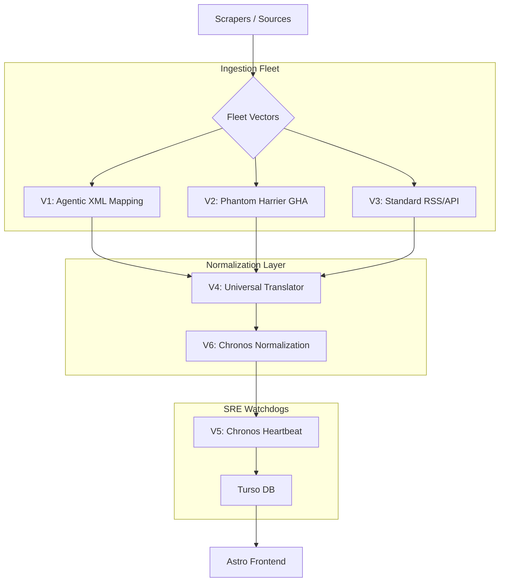

# VA.INDEX Architecture (v8.5 — Omni-Stack Fleet)
*Updated: 2026-04-03 (Agentic Normalization & Phantom Harrier)*

## 1. System Overview

VA.INDEX is an autonomous job signal aggregator targeting Filipino-accessible remote/VA opportunities. It operates as an "Omni-Stack" fleet, using 6 distinct vectors to ensure data freshness, schema flexibility, and temporal consistency.

## 2. The 6 Vectors of Autonomy

### Vector 1: Agentic XML Mapping (`jobs/lib/xml-mapper.ts`)
- **Mandate**: Handles non-standard XML/RSS feeds from obscure job boards.
- **Mechanism**: Cerebras Qwen 3 235B infers schema mappings on-the-fly, bypassing brittle parsers.

### Vector 2: Phantom Harrier (`scripts/phantom-harrier.ts`)
- **Mandate**: "Blind Extraction" from legacy job boards (e.g., OnlineJobs.ph).
- **Mechanism**: Scheduled GitHub Actions fetch raw HTML; LLMs extract signals into structured JSON.

### Vector 3: Standard Ingestion (`jobs/scrape-opportunities.ts`)
- **Mandate**: High-throughput harvesting from trusted APIs (Jobicy, Reddit, etc.).
- **Mechanism**: Drizzle-based upserts with strict schema validation.

### Vector 4: Universal Translator (`apps/frontend/src/middleware.ts`)
- **Mandate**: Inbound/Outbound signal normalization.
- **Mechanism**: Edge Middleware handles `/go` redirects and ensures `X-VA-Hub-Origin` headers are preserved for attribution.

### Vector 5: Chronos Heartbeat (`jobs/active-triage.ts`)
- **Mandate**: Fight architectural entropy and staleness.
- **Mechanism**: LLM-driven "Semantic Heartbeat" to verify if listings are still active/relevant.

### Vector 6: Chronos Normalization (`packages/db/utils.ts`)
- **Mandate**: Eliminate "Epoch Hallucination."
- **Mechanism**: All timestamps (10-digit, 13-digit, ISO) are normalized to 13-digit milliseconds for universal comparisons.

## 3. Freshness & Invariants

- **lastSeenAt**: Primary signal of life. Staleness > 2 hours triggers autonomous recovery.
- **Indexing**: `uniqueJobIdx` on `(title, company, sourceUrl)` prevents signal collisions.
- **Titanium Quota Guard**: 15 RPM throttling across all Gemini/Cerebras integrations to stay within Free Tier limits.

---
**FLEET STATUS: 🟢 FULLY OPERATIONAL. VECTOR 1-6 ENGAGED.**
