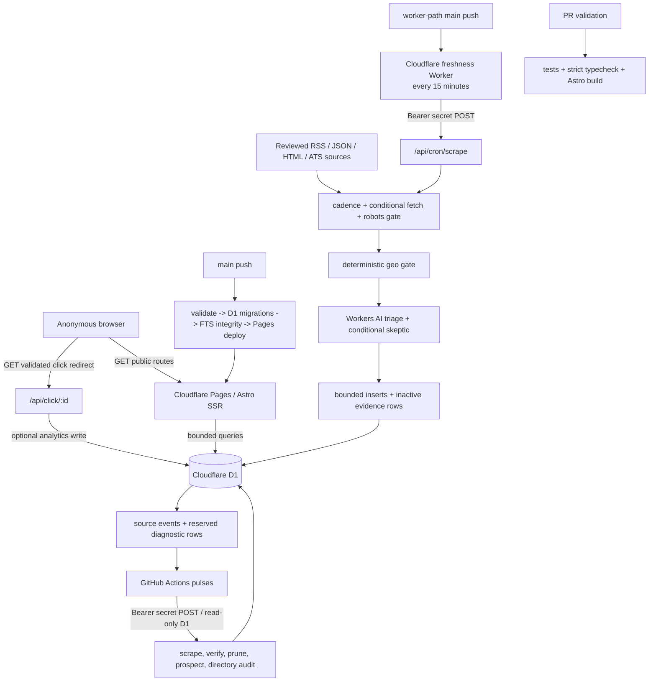

# Part 1 - Apex Codebase Audit, System Model, and Implementation Plan

Date: 2026-08-12  
Repository state audited: `a0e7a46` on `codex/audit-worktree-bootstrap`  
Production sampled: `https://remotejobs-ph.pages.dev` from Singapore on 2026-08-12  
Scope: discovery, retrieval, mapping, measurement, audit, challenge, ranking, and planning only  
Implementation status: no application code, infrastructure, data, or remote configuration was changed by this audit

## Executive decision

No unresolved P0 survived cross-examination. Broad refactoring is not justified.

The next implementation agent should first release the already-tested reliability work in PR #56 through the existing migration-first path, then make small, independently verifiable corrections. The highest-value current corrections are:

1. Repair the production FTS result-to-card contract. A fresh production query rendered 30/30 result links as `/api/click/{id}?url=undefined`.
2. Remove deprecated Workers AI model IDs and test the real model ladder/capability contract.
3. Make public click analytics fail closed and preserve validated redirects; do not add a Rate Limiting binding to Pages unless an isolated runtime probe proves that capability.
4. Restrict Prospector evidence to positively PH-eligible jobs before it asserts `hires_filipinos = 1`.
5. Close false-green watchdog, verifier, directory-audit, parser, sweep, and source-state paths.

The active Astro/Cloudflare/D1 architecture, bounded batch writes, fail-closed primary AI triage, soft-archive policies, effective-date indexes, FTS trigger semantics, and quarantined legacy systems should remain intact.

## Evidence vocabulary

| Label | Meaning |
| --- | --- |
| **MEASURED** | Produced during this audit by a command, HTTP sample, exact reproduction, or test. |
| **OBSERVED** | Directly present in source, workflow, configuration, current Git/GitHub state, or a dated operational artifact. |
| **DERIVED** | Follows mechanically from observed inputs, such as a missing tally bucket or percentage. |
| **INFERRED** | Best explanation supported by multiple signals but not directly measured in production. |
| **THEORETICAL** | A possible failure requiring production telemetry or a reproduction before implementation. |

All production samples are point-in-time evidence, not service-level objectives. Five-request timing samples are reported as median and maximum; they are too small to claim statistically meaningful P95/P99.

---

## A. System Model

### A1. Verified active topology

### A2. Component and ownership map

| Component | Primary locations | State owned | Trust/failure boundary | Criticality |
| --- | --- | --- | --- | --- |
| Public job board | `apps/web/src/pages/index.astro`, `opportunities.astro`, `categories/[category].astro`, `jobs/[id].astro` | None; reads D1 | Anonymous input is parsed and bounded; D1 failure becomes 503/no-store | User-critical |
| Opportunity card/link boundary | `apps/web/src/components/opportunity-card.tsx`, `api/click/[id].ts`, `lib/outbound-url.ts` | `click_count` | Public caller; redirect must equal a stored target | User and quota critical |
| Primary ingestion orchestrator | `apps/web/src/pages/api/cron/scrape.ts` | run lock, source state, opportunity lifecycle, sweep quota, diagnostics | Shared-secret caller; untrusted source bodies; Workers AI; partial D1 writes | System-critical, high fan-out |
| Direct ingest | `apps/web/src/pages/api/ingest.ts` | opportunity rows | Shared-secret caller; 2 MiB bounded request body; normalized server-owned mapping | Important, caller set uncertain |
| Source adapters | `packages/scraper/{rss,json,html,ats,conditional}.ts` | No durable state | Fixed external sources; timeouts exist, response byte ceilings do not | Reliability/compliance critical |
| Geo/AI triage | `packages/scraper/{geoGate,triage}.ts` | verdicts stored on opportunities | External text is untrusted; deterministic gate precedes AI; model output is parsed and sanitized | Correctness and AI-cost critical |
| D1 schema and migrations | `packages/db/schema.ts`, `packages/db/migrations` | Canonical application data and operational state | Migration order and SQLite/D1 limits | System-critical |
| Link verifier | `api/cron/verify-links.ts`, `packages/scraper/linkHealth.ts` | verification timestamp, strikes, active state | External network ambiguity must not deactivate without evidence | Data-quality critical |
| Directory audit | `api/cron/directory-audit.ts`, `gha-directory-pulse.yml` | link status/strikes, verification state | External network ambiguity; three-strike human-review policy | Trust-signal critical |
| Prospector | `api/cron/prospect.ts`, `packages/scraper/prospector.ts` | additive `va_directory` rows | Automated evidence-to-public-claim boundary | Data-integrity critical |
| Freshness clock | `workers/freshness-cron` | No durable state | Manually managed secret; sole automatic 15-minute trigger | System-critical single clock |
| Operational pulses | `.github/workflows/gha-*-pulse.yml` | digests, issues, bounded source pauses | GitHub secrets, D1 read access, workflow result contracts | Recovery/observability critical |
| Release pipeline | `.github/workflows/ci-guardrail.yml`, `deploy-migrations.yml` | Production schema and deployment | Main-only credentials; migration-before-code invariant | System-critical |

### A3. Critical execution paths

1. **Fresh ingestion:** scheduled Worker -> authenticated scrape -> atomic run-lock claim -> source cadence/robots/fetch -> URL sanitation/dedup -> deterministic geo gate -> AI triage/skeptic -> bounded D1 writes -> durable summary -> response assessment.
2. **Public discovery:** request parser -> D1 count/page query or FTS query -> server-rendered `OpportunityCard` -> internal detail page or validated outbound redirect.
3. **Freshness maintenance:** verifier selects oldest timestamps -> bounded external checks -> strikes/rotation -> workflow validates response and reports backlog.
4. **Directory maintenance:** rotating company cohort -> liveness classifier -> non-destructive strike policy -> committed digest.
5. **Automated discovery:** active opportunity evidence -> candidate query -> name/source classifier -> bounded additive directory inserts; ATS tokens remain paused until human promotion.
6. **Release:** PR validation -> main-only deployable-path detection -> D1 migration lock -> migrations -> FTS integrity -> Pages deploy. The freshness Worker deploys through its separate path-scoped workflow.

### A4. Authentication and trust boundaries

- Public GET routes and click redirects are anonymous. Redirect targets are accepted only when they exactly match the stored job source/application URL.
- Cron and ingest routes use a shared bearer/header secret through `isAuthorized()`. Same-origin unauthenticated probes returned 401; cross-site form posts were rejected by Cloudflare before app authentication.
- D1 and Workers AI are runtime bindings, not browser-accessible services.
- Source content and model output are untrusted data. They must never become executable workflow instructions or unsanitized redirect targets.
- GitHub Actions holds deployment and API secrets. Current deployment correctness depends on external secret/binding state that is not fully encoded in the repository.

### A5. Graph-first model and limitations

The generated repository graph is in `graphify-out/`:

- AST extraction: **393 nodes / 1,049 edges**.
- Semantic extraction: **557 nodes / 792 edges / 12 hyperedges**.
- Deduplicated union: **945 nodes / 1,421 edges**; 207 report edges are inferred.
- Central nodes: generic `POST()` (21 edges), `isAuthorized()` (18), `fetch()` (17), `nowUtcIso()` (15), and `getDb()` (14). The large `scrape.ts` orchestrator and Sentinel workflow are the highest-risk change hubs.
- High-value graph clusters include ingestion API routes, D1/FTS, conditional fetching, robots compliance, geo eligibility, AI model routing, CI guardrails, directory audit, Prospector, and ingestion observability.

Graph limitations are material:

- The AST extractor omits `.astro` route nodes, so public-route edges were checked directly.
- Generic symbol labels merge unrelated `POST`/`fetch` concepts.
- The installed graph library is older than the skill contract; custom validation found dangling external/import endpoints and several low-connectivity nodes.
- Inferred edges are navigation hypotheses, not proof. For example, the report's inferred `test() -> fetch()` edge is not a basis for a finding.
- Subagent token usage was not exposed. `graphify-out/cost.json` records zero with an explicit “unavailable” note; this is not a claim that semantic extraction cost zero tokens.

The graph is suitable for blast-radius navigation and retrieval compression, but every accepted finding below is also grounded in source, a reproduction, runtime evidence, or a dated operational artifact.

---

## B. Baselines

### B1. Repository and release state

| Evidence | Baseline |
| --- | --- |
| **OBSERVED** local HEAD | `a0e7a46`, branch `codex/audit-worktree-bootstrap` |
| **OBSERVED** remote production branch | `origin/main` at `4369f61` |
| **OBSERVED** divergence | 8 commits unique to `origin/main`; 8 unique to HEAD. The main-only side is digest automation churn. |
| **OBSERVED** PR | PR #56 is open and mergeable. Project-owned validation passed. GitHub reports `UNSTABLE` because a legacy Vercel status is red; `main` is not branch-protected. |
| **OBSERVED** release gap | The run-diagnostic heartbeat, D1-derived source rollup, unified crawler identity, robots cache/migration 0030, and observe-mode robots gate are not deployed. |
| **OBSERVED** dirty files present before audit | `apps/web/.astro/settings.json`, `apps/web/.astro/types.d.ts`, and `.claude/`. They are user/generated state and must not be reverted or swept into an implementation commit. |

The branch returns robots decisions in the scrape response, but that is **not durable observe evidence**: `recordSourceFetchEvents()` omits every robots field, run diagnostics have no robots signal, and the scheduled Worker reduces the response to insertion/change counts. Releasing PR #56 alone therefore does not create the reproducible 24-hour record required before enforcement.

### B2. Local verification baseline

| Check | Result | Label |
| --- | --- | --- |
| `bun run test` | 327 pass, 0 fail, 615 expectations, 36 files; Bun reported 9.84 s | **MEASURED** |
| `bun run typecheck` | Exit 0; 28.05 s | **MEASURED** |
| `bun run build` | Exit 0; 98.4 s wall time; Astro server 38.77 s, client 17.95 s; 1,756 modules | **MEASURED** |
| Built client chunks | entry 6.72 KB / 2.69 KB gzip; search island 13.08 / 4.90; React client 135.60 / 44.38 | **MEASURED** |
| Freshness Worker strict compile | Fails because `@cloudflare/workers-types` declared by its tsconfig is not installed in the root/workspace path | **MEASURED** by reliability audit |
| `git diff --check` | No whitespace error; line-ending warning only in an already-dirty generated Astro file | **MEASURED** |
| `bun audit --production` | 10 advisories: 2 high, 4 moderate, 4 low; exit 1 | **MEASURED**, applicability separately challenged |

A combined test/typecheck/build command exceeded a 120-second audit harness timeout because the isolated typecheck plus build took about 126 seconds. Exact orphaned build processes were terminated and the build was rerun successfully. This is a harness sequencing fact, not an application failure.

### B3. Production HTTP baseline

| Route | Status | Raw HTML bytes | Small-sample timing |
| --- | ---: | ---: | --- |
| `/` | 200 | 131,033 | five-run median 1.053 s; max 1.124 s |
| `/opportunities` | 200 | 78,691 | five-run median 0.802 s; max 0.888 s |
| `/opportunities?page=2` | 200 | 78,835 | one-shot only |
| `/opportunities?q=assistant` | 200 | 66,769-66,747 across samples | one-shot only |
| `/directory` | 200 | 69,475 | five-run median 0.747 s; max 0.878 s |
| `/categories/tech` | 200 | 75,993 | one-shot only |
| `/data-policy` | 200 | 10,629 | one-shot only |
| `/privacy` | 200 | 10,132 | one-shot only |
| `/sitemap.xml` | 200 | 137,589 | one-shot only |

**MEASURED:** a fresh `/opportunities?q=assistant` response contained 30 cards, 30 `/api/click/...url=undefined` links, zero `/jobs/{id}` links, zero rendered dates, and no geo badges. This turns finding COR-01 from a static contract concern into a verified production defect.

**MEASURED:** the homepage rendered 1,557 open roles and **438 “Vetted companies”**; `/directory` rendered **412 companies** at nearly the same time. The 26-company difference matches the divergent query predicates in finding DATA-02.

**OBSERVED:** public cache headers are `max-age=60, s-maxage=300, stale-while-revalidate=600`. CSP, Permissions-Policy, Referrer-Policy, `nosniff`, and frame denial are present. This caching materially mitigates cold-origin work and is part of the do-not-touch list.

### B4. Production data and operations baseline

The latest main-branch Medic digest is dated 2026-08-09, so these are current operational evidence but not a live query:

| Metric | Value | Derived ratio |
| --- | ---: | ---: |
| Active opportunities | 1,636 | - |
| Total opportunities | 4,246 | - |
| Directory rows | 429 | - |
| Active older than 30 days | 741 | 45.3% of active |
| Active unseen in source feed for 14+ days | 641 | 39.2% |
| Active never link-verified | 0 | 0% |
| Active missing company | 46 | 2.8% |
| Same title/company duplicate groups | 56 | group count, not row count |

Most seven-day source tallies were 425/425 successful attempts; We Work Remotely was 420/425. A zero-item row with every attempt marked skipped is expected for paused/cadenced sources and is not itself a failure.

The 2026-08-11 directory digest reports 60 checked, 37 OK, 2 bot-walled, and no hard-dead result. The response classifier has an exhaustive per-run tally and targets only nonempty websites. Therefore **21/60 results are mechanically the omitted `unreachable` bucket**. The digest and workflow summary do not show that bucket, and the route resets prior strikes for it. This is current evidence for REL-05, not a hypothetical outage.

Remote D1 migration/query-plan inspection from this workstation timed out. Local `.wrangler` state is stale and not production evidence. Migration 0030 is present on the branch and verified locally by prior work, but must be treated as **not deployed** until the main release workflow proves otherwise.

### B5. AI, token, and resource baseline

- **OBSERVED:** deterministic geo filtering runs before Workers AI; first-pass AI failure defers new items fail-closed.
- **OBSERVED:** fresh triage tries one active 70B model followed by three model IDs deprecated on 2026-05-30. The cheap-first sweep tries the same three deprecated IDs before the active 70B model. Sentinel/Hunter advisory ladders contain only deprecated IDs.
- **OBSERVED:** triage sends up to 1,500 description characters; the skeptic sends up to 1,200. The main ladder has up to four attempts and the skeptic up to two.
- **OBSERVED:** a D1-backed daily unclear-sweep cap is intended to limit AI work to 50 rows/day, but its quota-state write can fail silently (REL-04).
- **OBSERVED provider capability, not application telemetry:** Workers AI responses can expose input/output and cached-token usage, but this application does not persist it. Neuron totals remain a dashboard/account measurement rather than a guaranteed per-call field.
- **UNAVAILABLE:** actual calls/run, model fallback depth, recorded input/output/cached tokens, dashboard neurons, AI cost, prompt-cache hits, run-duration distribution, and provider error distribution. These must not be invented.
- **THEORETICAL bound:** the configured fallback ladders permit multiple full-prompt attempts per item. The real waste cannot be ranked until per-attempt model/usage telemetry and dashboard neuron totals are captured.

Cloudflare's current notice confirms the deprecated IDs and that the `-fast` 8B variant remains active: <https://developers.cloudflare.com/changelog/post/2026-05-08-planned-model-deprecations/>. Cloudflare's JSON Mode documentation lists both the active 8B-fast and 3.3-70B-fast models: <https://developers.cloudflare.com/workers-ai/features/json-mode/>.

### B6. Dependency/security baseline

`bun audit --production` is red, but the scanner total is not equivalent to ten exploitable production paths:

- The high Host-header Astro SSRF advisory explicitly excludes `@astrojs/cloudflare`.
- The high dynamic-slot XSS requires user-controlled named slots in a hydrated island; no such path was found.
- No `define:vars`, server islands, view transitions, dynamic slot names, relevant spread-prop rendering, Astro image binding, or `getImage` path was found.
- The esbuild notice is a local Windows dev-server file-read issue; this repository does not expose its dev server.
- The Cloudflare adapter image advisory targets the default `cloudflare-binding` image service; this app uses passthrough and no Astro image transform path.

Therefore dependency versions remain a governance/compatibility concern, not a demonstrated P0. ADR-005's Pages-compatibility pin must be honored until an explicit Pages-to-Workers migration is approved.

---

## C. Invariants

The implementation agent must preserve all of the following:

1. **Production architecture:** Bun workspaces, Astro/React islands, Cloudflare Pages, D1, the freshness Worker, and GitHub Actions pulses remain the active path.
2. **Migration before deployment:** schema migrations and FTS integrity must pass before Pages code using the schema is deployed.
3. **Primary triage fails closed:** if no first-pass AI model produces a valid result, a new item is deferred, not published as eligible.
4. **Deterministic-before-AI:** URL sanitation, deterministic geo signals, source policy, deduplication, and bounded parsing remain ahead of model work.
5. **Positive-claim boundary:** `hiresFilipinos = true`, `eligible_*` labels, and internal detail pages require positive evidence. Current direct ingest keeps deterministic `unclear` items active and public cards route non-positive rows externally; do not relabel that external-only discovery as positive evidence or change its visibility without an explicit policy decision and data review.
6. **No destructive cleanup:** opportunities are soft-archived with reasons; directory rows are hidden/de-verified only under documented evidence and human-review policy.
7. **Three-strike semantics:** only authoritative hard-dead link evidence increments a strike; ambiguous, bot-walled, transient, or network-unavailable results must not auto-hide content.
8. **Truthful outcome reporting:** “checked,” “inserted,” “retriaged,” “healthy,” and similar counters mean durable or explicitly attempted outcomes, not scheduled intentions.
9. **Bounded D1 writes:** keep batches under the 100-bound-parameter constraint and retain truthful partial-failure accounting.
10. **Public failure behavior:** D1-unavailable public routes return a visible 503/no-store state rather than an empty-success page.
11. **Redirect safety:** outbound redirects must match stored targets; analytics failure may never block a valid redirect or create an open redirect.
12. **Compliance posture:** use declared crawler identity, reviewed public endpoints, minimal metadata, source attribution, opt-out/correction, and no evasion.
13. **Robots staging:** durable, source-complete observe-mode evidence precedes enforcement; transient response/log fields are insufficient. ATS gating and crawl-delay scheduling are separate changes.
14. **Zero-cost constraint:** do not assume a paid Cloudflare service, queue, or new vendor without owner approval.
15. **Legacy quarantine:** Next.js/Vercel/Turso/Trigger.dev/Inngest/Zig assets remain historical and must not be reconnected accidentally.
16. **Healthy cache/index behavior:** preserve public edge caching, server pagination, FTS external-content semantics, and the existing global/category effective-date indexes.

---

## D. Ranked Findings

### P0

None accepted. Historical P0s are recorded in section J; they are either fixed on main or fixed on PR #56 but not yet released.

### P1 findings

#### OPS-01 - Critical reliability work is complete on PR #56 but absent from production

- **Category/location/graph:** release operations; PR #56; migration `0030_robots_cache.sql`; `run-diagnostics.ts`; Sentinel workflow; robots and crawler-identity cluster. Graph path: main push -> migration lock -> D1 migrations -> FTS check -> Pages deploy.
- **Evidence/root cause:** **OBSERVED.** HEAD and main diverge 8/8; the PR is open. The branch audit explicitly says “not yet merged or deployed.” Production therefore still lacks the durable scrape heartbeat and D1-derived rollup that close the orphaned-alerting regression. Root cause is release state, not missing implementation.
- **Impact/likelihood/blast/confidence:** systemic ingestion degradation can remain invisible; current production gap is certain; blast radius is all ingestion; confidence **high**. Project-owned CI passed, but the main-only migration/deploy path has not run for this branch.
- **Intervention/size/risk:** reconcile main's digest commits, independently review the 27-file diff, confirm required external secrets, then merge and let the existing migration-first workflow deploy. Complexity **M**; regression risk **M** because the PR contains 2,844 additions and a schema migration. Do not rewrite or split the already-tested implementation unless review finds a concrete issue.
- **Verification:** project tests/typecheck/build; migration 0030 listed remotely; FTS integrity passes; Pages smoke routes 200; first post-deploy scrape creates `__ingest_diag__`; Sentinel reads the heartbeat; source rollup advances; robots decisions appear in the direct scrape response but are explicitly labeled transient until COMP-01 adds durable capture. Roll back code if route or ingestion behavior regresses; do not roll back an already-applied additive migration destructively.
- **Memory:** `docs/major-audit-2026-08-11.md` is **VERIFIED CURRENT for branch intent**, not production state.

#### COR-01 - FTS search returns snake_case rows to a camelCase card contract

- **Category/location/graph:** correctness/public search; `opportunities.astro:34,67-99,262-264`; `opportunity-card.tsx:54-75`; `schema.ts:20-55`; FTS migrations 0026-0027. Graph path: `opportunities_fts` -> raw SQL -> card -> click/detail link.
- **Evidence/root cause:** **MEASURED.** Raw `SELECT o.*` through `db.all()` bypasses Drizzle mapping. An exact local reproduction returned snake_case keys. Production rendered 30/30 search cards with `url=undefined`, no detail links, dates, or geo badges. `pageJobs` is untyped, so typecheck cannot see the boundary mismatch.
- **Impact/likelihood/blast/confidence:** every nonempty `/opportunities?q=*` result has a broken primary action and missing metadata; likelihood **certain**; blast radius is search only; confidence **0.99**.
- **Intervention/size/risk:** explicitly alias a narrow card projection to camelCase while preserving `fts.rank`; type the row boundary. Complexity **S**; risk **low-medium** because FTS ordering/filtering must remain unchanged. Do not alter migrations 0026-0027.
- **Verification:** route-level D1 fixture test asserts ranking, filters, camelCase values, `/jobs/{id}` for eligible rows, valid external links otherwise, and absence of `url=undefined`. Production smoke must find zero undefined links across at least two queries.
- **Memory:** prior FTS integrity work is **VERIFIED CURRENT** but did not cover row-to-view mapping.

#### SEC-01 - Public click analytics fails open without a proven Pages rate-limit capability

- **Category/location/graph:** realistic abuse/quota risk; `api/click/[id].ts:45-63`; `apps/web/wrangler.jsonc:9-24`; `env.d.ts:14`; public card -> click route -> optional limiter -> shared D1.
- **Evidence/root cause:** **OBSERVED + current platform documentation.** The live-downloaded checked-in Pages config declares D1 and AI but no `API_RATE_LIMITER`. The route initializes `allowWrite = true`; a missing binding therefore allows every validated anonymous GET to increment D1. Public cards expose both the job ID and exact allowed target. In addition, the metric update shares the outer `try`, so a limiter or D1 increment exception returns 500 instead of the already-validated redirect. Cloudflare's Rate Limiting binding page is a **Workers** API; the current Pages Functions binding list does not include Rate Limiting, and the current Wrangler Pages schema excludes it. Historical evidence proved only that an older command parsed a field and a Pages deployment completed—not that `env.API_RATE_LIMITER` existed at runtime. Tests cover target equality, not route write control or analytics-failure behavior.
- **Impact/likelihood/blast/confidence:** click inflation and D1 write-quota exhaustion can interfere with ingestion/maintenance; quota/write failure can then deny valid outbound navigation. Anonymous reachability makes likelihood **medium-high**; blast radius is click navigation, analytics, and the shared D1 budget, not confidentiality; confidence **high for repository behavior/config**, medium for live dashboard state.
- **Intervention/size/risk:** make analytics fail closed: default to no write when no proven limiter exists, and isolate limiter/D1 exceptions so optional counting can never block the already-validated redirect. Because no application reader of `click_count` was found, disabling the increment is the smallest safe Pages-compatible default. If click analytics must be retained, run a separate non-production Pages capability experiment first; change production config only if a preview deployment proves `env.API_RATE_LIMITER` exists. Otherwise use a Pages-supported edge control or leave analytics disabled. Complexity **S**; risk **low**.
- **Verification:** absent-binding, present/allowed, over-limit, limiter-error, and D1-update-error route tests; all validated cases redirect and only proven-allowed analytics writes occur. An isolated preview capability probe must assert the runtime binding, not merely Wrangler parsing. Do not add `ratelimits` to production Pages config on the present evidence.
- **Memory:** historical Wrangler parsing/deploy evidence is **INSUFFICIENT**; the current official Pages binding list contradicts the assumed production design.

#### AI-01 - Runtime and workflow ladders reference models deprecated on 2026-05-30

- **Category/location/graph:** AI correctness/cost/latency; `triage.ts:288-320,444-459`; `scrape.ts:610-638`; Sentinel lines 306/370; Hunter line 455. Graph path: source -> deterministic gate -> triage/skeptic -> D1, plus workflow advisory paths.
- **Evidence/root cause:** **OBSERVED + current primary-source verification.** Three fallback IDs are on Cloudflare's May 30 deprecation list. The sweep tries all three before the active 3.3-70B model; workflow advisory loops contain only deprecated IDs. JSON mode is enabled only by a string check for `llama-3.3`, although the active `llama-3.1-8b-instruct-fast` also supports it. Tests do not mock `AI.run` or assert ladder order/options.
- **Impact/likelihood/blast/confidence:** avoidable failed calls/full prompts, loss of cheap fallback, stalled sweep/advisory output, and possible reliance on the expensive active rung. Configuration drift is certain; provider hard-error/alias behavior is uncertain. Blast radius includes fresh triage fallback, skeptic, sweep, and AI diagnostics. Confidence **high** on stale config, **medium** on runtime symptom.
- **Intervention/size/risk:** replace retired cheap rungs with documented-active IDs, use a capability set rather than name substring for JSON mode, centralize TypeScript ladder constants, and add a guard that rejects retired IDs in runtime/workflows. Preserve first-pass fail-closed semantics. Freeze a representative/adversarial PH-geo evaluation corpus before changing models. Record model, attempt, latency, result, and response `usage` input/output/cached tokens per attempt; obtain neuron totals from the account dashboard. Complexity **S-M**; risk **medium** because model behavior changes.
- **Verification:** mocked `AI.run` tests for exact order, JSON options, malformed response, quota error, and all-rungs-fail; no retired ID remains in active code/workflows. On the frozen corpus, explicit non-PH hard negatives have zero false positives and eligible/unclear precision-recall is non-inferior to the current active 3.3-70B baseline. A staging/manual pulse records selected model, fallback depth, latency, token usage, and the dashboard neuron delta; mock conformance alone is not release evidence.
- **Memory:** historical cost rationale is **VERIFIED INTENT** but model availability memory is **CONTRADICTED** by current provider documentation.

#### REL-01 - The sole ingestion clock can succeed while doing no work, and its watchdog can miss cold start indefinitely

- **Category/location/graph:** reliability/observability; `workers/freshness-cron/src/index.ts:30-53`; `gha-deploy-cron-worker.yml:3-5,37-38`; branch Sentinel `:25-28,134-153`. Graph: scheduled -> ping -> scrape -> `recordIngestDiagnostics` -> watchdog query.
- **Evidence/root cause:** **OBSERVED.** A missing `PROXY_SECRET` logs and resolves successfully. Worker deployment assumes the manually managed secret. The Sentinel is daily despite a three-hour threshold, so worst-case alert delay is about 24 hours. A missing `__ingest_diag__` row exits successfully without a bounded rollout grace and can do so forever when no first scrape completes. The Worker source also records historical GitHub cron drift of roughly 1.5-3 hours; an hourly GitHub watchdog therefore cannot honestly guarantee detection inside three hours.
- **Impact/likelihood/blast/confidence:** all new-job ingestion can stop with green automation; secret/config drift is plausible; system-wide blast radius; confidence **high**. Current ingestion proves the present secret likely exists, not that the design is safe after redeploy/reset.
- **Intervention/size/risk:** throw on missing secret; verify the secret name during deployment; treat a missing diagnostic row as alertable after an explicit deployment grace period. Add a lightweight heartbeat monitor only with an explicit, evidence-based delivery objective. If a strict sub-three-hour alert is required, use an independently scheduled monitor with sufficient margin; an hourly GitHub cron may be kept only as best-effort until measured delay supports a stated window. Complexity **S-M**; risk **low**.
- **Verification:** missing-secret rejection; grace-window tests; an actual synthetic outage creates and delivers the expected issue/notification; first deployment does not false-page before grace expires. Capture scheduled-time, actual-start, stale-detection, issue-created, and notification-received timestamps over a representative window, report p50/p95/max end-to-end latency, and promise no tighter SLA than the evidence supports.
- **Memory:** the branch's restored diagnostic design is **VERIFIED CURRENT**, but an “under three hours” operational promise is **UNSUPPORTED** by either the daily schedule or an unmeasured hourly GitHub cron.

#### DATA-01 - Prospector treats active `unclear` jobs as proof a company hires Filipinos

- **Category/location/graph:** data integrity/policy; `api/cron/prospect.ts:17-23,64-84,105-125`; `prospector.ts:3-14,183-211`; `ingest.ts:46-83`; directory visibility. Graph: opportunity candidate SQL -> `classifyCandidates()` -> `vaDirectory`.
- **Evidence/root cause:** **MEASURED.** Ingest leaves every verdict except `ineligible` active. Prospector filters only `is_active = 1` despite saying candidates are “already-eligible,” then writes `hiresFilipinos: true`. An exact in-memory fixture with two active `unclear` trusted-source jobs reached `autoAdd`.
- **Impact/likelihood/blast/confidence:** a persistent public directory claim can be created without positive PH evidence; likelihood **medium-high** when a trusted source has two unclear jobs; bounded to 15 additions/run but potentially 60/day; confidence **0.99**.
- **Intervention/size/risk:** require `ph_eligibility IN ('eligible_verified','eligible_likely')` in the grouped candidate query and correlated sample-URL subquery. Complexity **S**; risk **low**, intentionally reducing discovery.
- **Verification:** execute the real candidate SQL against eligible, unclear, and ineligible fixtures; only the positive pair may reach `autoAdd`; existing name/source/anomaly gates remain unchanged.
- **Memory:** “inherits eligibility for free” is **CONTRADICTED**; the two other Prospector gates remain valid.

#### REL-02 - Verifier network failures wedge the oldest cohort while reporting it fully checked

- **Category/location/graph:** reliability/silent failure; `verify-links.ts:63-72,84-89,165-189`; verifier workflow `:45-55`. Graph: verifier POST -> fetch/classifier -> opportunity timestamps -> workflow metrics.
- **Evidence/root cause:** **OBSERVED.** The route always selects the 120 oldest `lastVerifiedAt` rows. A network exception logs but does not advance the timestamp; rejected `Promise.allSettled` results are ignored; response `checked` equals selected rows. The same failing cohort can be selected forever while later links starve.
- **Impact/likelihood/blast/confidence:** link-health and geo deep-scan rotation can halt while automation stays green; network failures are routine enough for likelihood **medium**; blast radius can become the entire backlog; confidence **high**. The current digest's zero never-verified rows shows it is not presently fully wedged.
- **Intervention/size/risk:** treat `lastVerifiedAt` as last attempt consistently by stamping non-authoritative network failures without adding/resetting strikes; return `attempted`, `succeeded`, and `failedChecks`; alert on systemic failure ratio. Complexity **S**; risk **low**.
- **Verification:** inject 120 rejected fetches across two runs; second run selects a different cohort, reports 120 failures, preserves strikes, and never deactivates a row from network-only evidence.
- **Memory:** prior “queue drains at 120/run” reasoning is **CONDITIONAL**, not true under persistent exceptions.

#### REL-05 - Directory egress failures are green, omitted from the digest, and erase prior strike evidence

- **Category/location/graph:** reliability/data integrity; `linkHealth.ts:129-134`; `directory-audit.ts:64-84,119-129`; directory workflow `:41-77,99-111`. Graph: directory audit -> link checker -> directory strikes -> digest.
- **Evidence/root cause:** **OBSERVED + DERIVED current operation.** Network failures become non-hard `unreachable`; all non-hard outcomes take a branch that resets strikes. The workflow validates only HTTP status and omits `tally.unreachable`. In the latest digest, 60 were checked and only 39 belong to displayed per-run verdict buckets, mechanically leaving 21 `unreachable` results. The run stayed green.
- **Impact/likelihood/blast/confidence:** a total/partial egress outage can erase one or two prior hard-dead strikes, create false recovery, and remain absent from repo-readable evidence; a 35% unreachable sample is current evidence; directory-wide blast radius; confidence **high**.
- **Intervention/size/risk:** preserve strikes for `unreachable` (no evidence), surface its count/ratio in response/digest/summary, and fail or alert only on a systemic threshold. Do not auto-hide companies on network ambiguity. Complexity **S-M**; risk **low**.
- **Verification:** all-fetches-throw fixture preserves existing strikes, reports 100% unreachable, and produces a non-green operational result without de-verifying any company; a later authoritative success may reset strikes.
- **Memory:** the three-strike human-review design is **VERIFIED CURRENT** and should be preserved; the comment calling every non-hard result “healthy” is **CONTRADICTED** for `unreachable`.

### P2 findings

#### REL-03 - An all-invalid URL parser regression is recorded as a clean scrape

- **Category/location/graph:** silent failure; `scrape.ts:1311-1370`; `scrape-response.ts:28-59`; sanitizer -> diagnostics -> Worker response assessor.
- **Evidence/root cause:** **OBSERVED + exact assessor reproduction.** `droppedNoUrl` is computed, but the `allItems.length === 0` early return omits it and executes before the warning. The Worker accepts `{}` as a completed zero-change response because only four optional unresolved counters are checked.
- **Impact/likelihood/blast/confidence:** a source or shared parser can produce N unusable jobs, log a successful fetch count, persist nothing, and keep every layer green; likelihood **medium-low**; system-wide if the shared sanitizer regresses; confidence **high**.
- **Intervention/size/risk:** include `droppedNoUrl` on every exit and durable diagnostic; treat positive values as unresolved work; require a recognized terminal response shape. Complexity **S**; risk **low**.
- **Verification:** all-invalid route fixture; `{}` rejection; positive `droppedNoUrl` produces a degraded diagnostic while normal zero-change and lock-held responses remain valid.
- **Memory:** July silent-failure controls are **VERIFIED INTENT** but incomplete on this early return.

#### REL-04 - Sweep success counters and the daily AI cap go false-green on D1 write failure

- **Category/location/graph:** reliability/AI cost; `scrape.ts:702-780,1775-1784`; `sweep.test.ts`; sweep -> opportunities/source state -> diagnostics.
- **Evidence/root cause:** **OBSERVED.** `retriaged`, `deactivated`, and `upgraded` increment before writes; catch logs but retains success. Quota persistence is swallowed; failure can make each of 96 ticks believe budget remains despite `DAILY_SWEEP_CAP = 50`. Diagnostics omit both failure classes.
- **Impact/likelihood/blast/confidence:** false backlog convergence and uncontrolled pressure on the shared Workers AI allocation; D1 failure likelihood **medium-low**, consequence meaningful; blast radius sweep plus fresh triage quota; confidence **high**.
- **Intervention/size/risk:** increment only after durable writes; expose verdict/quota write failures; if quota state is unavailable, run zero sweep work while leaving main ingestion available. Complexity **M**; risk **low-medium**.
- **Verification:** rejecting fake-DB updates/upserts yields zero success, a degraded diagnostic, and no next-tick sweep; main non-sweep ingestion still completes.
- **Memory:** daily cost cap intent is **VERIFIED**, enforcement under persistence failure is **CONTRADICTED**.

#### REL-06 - Conditional state and Workable rotation writes are absent from durable diagnostics

- **Category/location/graph:** observability/resource efficiency; `scrape.ts:845-856,1106-1119,1152-1160,1245-1275`; `run-diagnostics.ts:36-53`.
- **Evidence/root cause:** **OBSERVED.** source-state and ATS/rotation upserts swallow errors without returning an outcome; callers cannot aggregate them; diagnostics have no fields for them.
- **Impact/likelihood/blast/confidence:** a “clean” run can lose validators/cadence and refetch unnecessarily or let the same Workable subset monopolize rotation; likelihood **medium-low**; affected source group to all configured sources; confidence **high**.
- **Intervention/size/risk:** return aggregate write outcomes and include them in response/durable summary while keeping the writes fail-soft for otherwise valid jobs. Complexity **S-M**; risk **low**.
- **Verification:** independently reject each state write; scrape remains 200 when job persistence is sound, but response and `__ingest_diag__` are degraded.
- **Memory:** diagnostic persistence must remain secondary and nonfatal; that invariant is **VERIFIED CURRENT**.

#### OPS-02 - Manual Hunter's multi-batch contract conflicts with the eight-minute run lock

- **Category/location/graph:** recovery/concurrency; `scrape.ts:404-432,1065-1070`; Hunter `:61-102`; scrape -> run lock -> Hunter response parsing.
- **Evidence/root cause:** **OBSERVED.** A successful call leaves the lock timestamp fresh for eight minutes. Hunter sleeps two seconds, calls again, maps the lock response's absent `backlogRemaining` to zero, and exits as if drained. An already-running Worker can make the entire manual recovery a successful no-op.
- **Impact/likelihood/blast/confidence:** advertised ten-batch recovery performs at most one batch; likelihood **high whenever backlog remains**; blast radius manual recovery/acceptance; confidence **high**. A production run exceeding eight minutes and overlapping is only **THEORETICAL** because duration data is absent.
- **Intervention/size/risk:** first make the contract truthful: a lock-held response is explicit incomplete/retry state, and Hunter must not convert it to zero backlog. Prefer a single bounded call plus clear remaining-work report over waiting 80 minutes. Add run duration/owner telemetry before redesigning the lock; use an owner/renew/release lease only if measured duration/recovery need justifies it. Complexity **S now, M if lease work is proven**; risk **low then medium**.
- **Verification:** two sequential calls under TTL cannot report false completion; a Worker-held lock makes manual recovery non-green/incomplete; duration distribution is collected before TTL changes.
- **Memory:** the lock's overlap-prevention purpose is **VERIFIED CURRENT** and should not be casually removed.

#### DATA-02 - Homepage “Vetted companies” count uses a broader population than the directory

- **Category/location/graph:** public correctness; `index.astro:27-30,136-143`; `directory.astro:76-89`; migration 0024; shared `vaDirectory` table.
- **Evidence/root cause:** **MEASURED + OBSERVED.** Homepage counts every row; directory requires `hiresFilipinos = 1` and fewer than three link strikes. Production displayed 438 versus 412. Soft-hidden non-PH/duplicate/defunct rows are therefore included under the “Vetted” label.
- **Impact/likelihood/blast/confidence:** public trust metric overstates the browsable vetted set; certain; homepage-only blast radius; confidence **0.99** after production measurement.
- **Intervention/size/risk:** use the exact directory visibility predicate for the homepage count. Separately decide whether “vetted” should also require `is_verified = 1`; do not silently change that product definition in the same patch. Complexity **XS**; risk **low**.
- **Verification:** visible, soft-hidden, and three-strike fixtures; homepage and unfiltered directory totals match; production values converge after cache expiry.
- **Memory:** migration 0024's soft-hide policy is **VERIFIED CURRENT**.

#### AI-02 - Skeptic outage silently degrades two-vote consensus to one vote for gate-unknown jobs

- **Category/location/graph:** AI correctness/observability; `triage.ts:421-472`; `scrape.ts:1578-1680`; geo masterplan lines 109-113; geo audit lines 273-275.
- **Evidence/root cause:** **OBSERVED.** The masterplan and route comment require a second adversarial vote before a gate-unknown job publishes. If every skeptic model fails, the helper returns `eligible: true, aiUnavailable: true`; the new-item path publishes `eligible_likely` and records only “AI triage passed,” with no counter or single-vote evidence. The sweep at least labels the same condition “single vote.” A local helper comment intentionally prefers availability, creating a real policy conflict.
- **Impact/likelihood/blast/confidence:** jobs without structured geo evidence can publish on one model during partial AI failure; likelihood **medium** until provider telemetry exists; per-item public correctness blast radius; confidence **high** on behavior, medium on frequency.
- **Intervention/size/risk:** first add `skepticAiUnavailable` metrics/evidence and regression tests. Recommended policy is to defer gate-unknown items when the required skeptic is unavailable, matching first-pass fail-closed behavior—but pair that change with durable retry/cooldown state keyed by source URL plus content hash, retain conditional validators, cap attempts/day, and preserve queue fairness. Otherwise the same item can be refetched and rerun through first-pass plus skeptic every 15 minutes. Require an independent critic because this changes an explicit availability/correctness/cost tradeoff. Complexity **M**; risk **medium**.
- **Verification:** skeptic-unavailable gate-unknown item does not publish; gate-verified positive still skips skeptic; consensus agreement publishes; disagreement quarantines; counters and evidence distinguish all four paths. Repeated identical ticks retain validators, obey retry backoff and a daily attempt cap, eventually retry, and do not starve new items; measure calls/day and oldest-pending age.
- **Memory:** two-vote consensus is **VERIFIED INTENT**; “never block on skeptic outage” is **CONTRADICTED POLICY** requiring explicit resolution.

#### DATA-04 - Direct ingest leaves deterministic `unclear` jobs active on public discovery surfaces

- **Category/location/graph:** data policy/public contract; `api/ingest.ts:46-82`; `index.astro:41-47`; `opportunities.astro:51-77`; category list equivalent; `opportunity-card.tsx:60-70`. Direct authenticated ingest -> deterministic geo gate -> `is_active` public queries -> internal/external card routing.
- **Evidence/root cause:** **OBSERVED reachable behavior; production incidence unavailable.** Direct ingest marks every deterministic verdict except `ineligible` active. Homepage, search/default opportunities, and category queries filter public rows primarily by `is_active`; the card correctly sends non-positive rows to the external source instead of an internal detail page. No scheduled in-repo caller was established, so the number and provenance of affected rows are unknown, but the policy boundary is real and must not be described as a preserved positive-evidence invariant.
- **Impact/likelihood/blast/confidence:** unclear rows can appear on broad discovery surfaces without a positive PH verdict; whether that is intentional external-only indexing or an eligibility leak is an unresolved product-policy decision. Reachability confidence **high**; live frequency/impact **unknown**; blast radius is direct-ingest rows and public labeling, not the positively eligible detail path.
- **Intervention/size/risk:** first identify all external callers and run a read-only count/sample of active `unclear` rows by source and ingestion path. Then choose explicitly: (A) preserve external-only discovery, label/filter it so no “eligible” or “vetted” claim is implied, and retain external routing; or (B) insert unclear direct-ingest rows inactive/quarantined until triage supplies positive evidence. Do not mutate existing rows or change visibility before this decision and an independent critic. Complexity **S analysis, S-M implementation**; risk **medium**.
- **Verification:** caller inventory and cohort query are archived; eligible/unclear/ineligible fixtures prove the chosen policy on home, opportunities, category, search, and detail/external links; Prospector and company claims still require positive evidence; before/after public counts are explained and reversible.
- **Memory:** the earlier “no direct-ingest defect” conclusion is **NARROWED**: production incidence remains unproved, but the reachable policy boundary is confirmed.

#### SEC-02 - External feed/ATS bodies are fully buffered without byte ceilings

- **Category/location/graph:** reliability/resource safety; `conditional.ts:66-86`; `rss.ts:82-96`; `json.ts:112-125`; `ats.ts`; `robotsGate.ts:185-199`; `linkHealth.ts:115-128`; `verify-links.ts:102-118`; scrape concurrency groups. External source/page -> full buffer/parser -> AI/D1 or verification state.
- **Evidence/root cause:** **OBSERVED.** `res.text()`/`res.json()` buffers complete third-party responses; item/snippet `.slice()` calls happen only after the full body is materialized. `robotsGate` declares a 64 KiB stored-body maximum, but also slices only after `res.text()`, so it is not a streaming memory bound. RSS/JSON groups, up to eight ATS fetches, robots checks, and link/page verification all consume untrusted response bodies. Timeouts exist; authoritative byte ceilings and chunked-overflow tests do not.
- **Impact/likelihood/blast/confidence:** a malformed/compromised/accidentally huge response can exceed the Workers 128 MB isolate budget and terminate a scrape; fixed sources lower likelihood to **low-medium**; one run to repeated whole-pipeline freshness failure; confidence **high** on missing bound, medium on materiality.
- **Intervention/size/risk:** measure legitimate response sizes for feeds, ATS, robots, directory/link checks, and verifier pages; then reuse the existing authoritative stream-counting pattern from `request-body.ts` with source-class ceilings, early `Content-Length` rejection, and chunked overflow cancellation. Keep snippet/storage limits separate from network-read limits. Complexity **M**; risk **medium** if ceilings are guessed.
- **Verification:** near-limit success, 304/hash behavior, declared and chunked overflow rejection/cancellation for each source class, and oversized ATS/RSS/robots/page checks recorded as isolated source/check failures instead of Worker crashes. Confirm cancellation releases the reader and a concurrent oversized response does not abort unrelated sources.
- **Memory:** Cloudflare currently documents no response-body limit and 128 MB/isolate; buffering can raise “memory limit before EOF.”

#### OPS-03 - The sole-clock Worker is outside the root typecheck contract

- **Category/location/graph:** CI/developer effectiveness; root `package.json:6-16`; Worker tsconfig; CI validation; worker deploy workflow.
- **Evidence/root cause:** **MEASURED.** Root workspaces/typecheck omit `workers/freshness-cron`; its tests import response assessment, not `index.ts`; direct strict compile fails for missing Workers types. First full bundling is main-only deployment.
- **Impact/likelihood/blast/confidence:** PR CI can be green while a clock edit fails after merge; likelihood **medium on future edits**; system-wide freshness blast radius; confidence **high**.
- **Intervention/size/risk:** make the Worker a properly installed workspace or give it an explicit clean-install/typecheck/dry-run CI job on relevant PR paths. Complexity **S**; risk **low**.
- **Verification:** clean-checkout Worker typecheck and `wrangler deploy --dry-run` pass before merge; intentionally broken Worker type fails PR CI.
- **Memory:** Pages app verification is **VERIFIED CURRENT**; Worker coverage assumption is **CONTRADICTED**.

#### DATA-03 - The active set carries a large freshness/quality review backlog

- **Category/location/graph:** data lifecycle; Medic digest, verifier/prune/source-state flows.
- **Evidence/root cause:** **OBSERVED dated evidence.** On 2026-08-09, 45.3% of active rows were older than 30 days, 39.2% had not appeared in a feed for 14+ days, 46 lacked company, and 56 title/company duplicate groups existed. These populations overlap and source cadence may explain part of them; no live row-level sample was available.
- **Impact/likelihood/blast/confidence:** stale/noisy public inventory and trust erosion are plausible; current counts are certain for the digest date, policy failure is not; board-wide blast radius; confidence **medium** on remediation priority.
- **Intervention/size/risk:** read-only source-stratified analysis first. Sample rows by source/status/age; distinguish source-paused, legitimate long-lived ATS, feed-unseen, duplicate, and malformed-company cohorts. Change one source/threshold at a time; retain soft archive. Complexity **M analysis, variable implementation**; risk **high for bulk mutation**.
- **Verification:** before/after cohort counts, sampled precision, no deletion, reversibility, source-level health, and public count change explained in a digest.
- **Memory:** prior bulk-cleanup proposals are **REJECTED**; bounded archive policy is **VERIFIED CURRENT**.

#### COMP-01 - Robots enforcement and coverage remain deliberately incomplete

- **Category/location/graph:** compliance; branch `scrape.ts:41-61,952-1025`; robots gate/store/cache; separate ATS path; crawler masterplan 4A-4D.
- **Evidence/root cause:** **OBSERVED.** PR #56 implements and tests observe/enforce decisions only at the configured RSS/HTML/JSON choke point; default is observe. It attaches robots fields to the transient source result, but `recordSourceFetchEvents()` drops them, run diagnostics omit them, and the scheduled Worker keeps only insertion/change totals. Consequently an autonomous 24-hour run does not leave reproducible source-by-source observe evidence. ATS gating and crawl-delay scheduling are explicitly deferred. Staging is correct; the evidence path is incomplete.
- **Impact/likelihood/blast/confidence:** source policy changes are visible but not yet blocking after release; ATS paths remain outside runtime robots decisions; compliance blast radius is source-specific to broad; confidence **high**.
- **Intervention/size/risk:** first add an additive migration and event writer fields (or an equally durable versioned archive) for source, mode, verdict, evidence, would-block, crawl-delay, AI-input allowance, cache provenance, and observation time; recompute the D1 bind-safe batch size and expose capture completeness. After deployment, collect at least 24 hours of complete configured-source/tick coverage and review it. Only then flip configured-source enforcement in a separate commit. Add ATS gating as another slice; add crawl-delay scheduling only with `next_fetch_at`/cadence design. Complexity **M for evidence capture, S for flip, M for ATS/scheduling**; risk **medium-high if bundled or premature**.
- **Verification:** event-schema migration precedes code; deliberately varied robots fixtures persist round-trip; failed evidence writes degrade diagnostics; an archived report proves expected configured sources/ticks are complete before the 24-hour clock starts. Enforcement then shows explainable source-level blocks/pauses, no silent inventory collapse, an isolated rollback commit, and updated compliance notes.
- **Memory:** the 2026-08-11 staging checklist is **VERIFIED CURRENT for the branch**.

### P3 findings

#### PERF-01 - List routes overfetch full opportunity rows for an 11-field card

- **Category/location/graph:** D1 transfer/Worker memory; `opportunities.astro:96-118`; `categories/[category].astro:62-68`; schema -> card.
- **Evidence/root cause:** **OBSERVED.** Default/category queries select about 30 columns including descriptions/hashes/internal state for 30 cards; card rendering reads roughly 11. Homepage already uses a slim projection.
- **Impact/likelihood/blast/confidence:** certain overfetch on uncached list renders, but browser HTML is unaffected and production D1 result-byte/memory savings are unmeasured; blast radius list/category pages; confidence **1.0 on overfetch, 0.82 on materiality**.
- **Intervention/size/risk:** after COR-01, measure serialized row bytes using representative descriptions. Reuse a typed card projection only if savings are meaningful. Complexity **S**; risk **low**.
- **Verification:** before/after D1 result bytes and cold-origin timing; rendered card parity. Revert if savings are negligible or type complexity grows.
- **Memory:** the old 1.75 MB browser payload is **CONTRADICTED** by current 131 KB homepage HTML.

#### PERF-02 - Homepage cold render serializes independent D1 work and sorts the active corpus

- **Category/location/graph:** origin latency; `index.astro:27-84`; homepage -> D1 counts/window/card fetch/totals.
- **Evidence/root cause:** **OBSERVED + synthetic plan.** Five awaits are sequential although counts/totals and rank-ID query are independent. Synthetic SQLite `EXPLAIN` uses a temp B-tree for the partitioned window query; default/category queries correctly use existing indexes. Edge caching mitigates this to cold/revalidation requests.
- **Impact/likelihood/blast/confidence:** avoidable cold-origin stages; current public medians are acceptable and cache-hit state is unknown; homepage only; confidence **0.85**.
- **Intervention/size/risk:** measure true origin timing and production `EXPLAIN`; if material, run independent queries concurrently, then dependent card fetch. Do not add an index without production evidence. Complexity **S**; risk **low-medium**.
- **Verification:** cold-origin trace shows critical path falls from five awaits to two with identical content; D1 concurrency stays within platform constraints.
- **Memory:** indexes 0018/0029 are **VERIFIED EFFECTIVE** and should remain.

#### REL-07 - Sweep diagnostic warnings never record recovery

- **Category/location/graph:** alert quality; `scrape.ts:654-683`; Sentinel sweep read/summary.
- **Evidence/root cause:** **OBSERVED.** `__sweep_diag__` is written on failure; success never clears/current-stamps it. Sentinel reads `last_error`, so a historical outage can repeat forever.
- **Impact/likelihood/blast/confidence:** alert fatigue and ambiguous recovery; likely after first AI outage; sweep observability only; confidence **high**.
- **Intervention/size/risk:** store current success/recovery time and alert only on fresh/sustained failures while retaining optional history. Complexity **S**; risk **low**.
- **Verification:** failure-followed-by-success clears active error and stops warning; failure history remains inspectable if retained.
- **Memory:** no conflict.

#### DEP-01 - Dependency scanning lacks a reviewed exception/compatibility policy

- **Category/location/graph:** dependency governance; package manifests, CI, ADR-005.
- **Evidence/root cause:** **MEASURED.** `bun audit --production` exits 1 with ten advisories; current CI does not evaluate them. Targeted source review rejected the highest notices as inactive paths, while a blind major adapter upgrade would break the Pages boundary.
- **Impact/likelihood/blast/confidence:** new applicable advisories can arrive unnoticed, while naive “make audit green” work can cause a platform migration; ongoing likelihood; repository-wide potential; confidence **high** on governance gap, low on current exploitation.
- **Intervention/size/risk:** add a scheduled/PR dependency report with documented path-based exceptions, owner, review date, and expiry. Treat a Pages-to-Workers upgrade as an ADR/project, not routine patching. Complexity **S-M**; risk **low for reporting, high for blind upgrades**.
- **Verification:** known exceptions are explicit and time-bounded; a new unreviewed high advisory fails or flags clearly; build/deploy compatibility remains proven.
- **Memory:** ADR-005 is **VERIFIED CURRENT**.

### D1. Cross-examination: rejected or downgraded hypotheses

The following were investigated and rejected as current high-priority findings:

- **No broad rewrite of `scrape.ts`.** It is a large, central orchestrator, but size/centrality alone is not evidence. Accepted changes are localized behavior contracts with dedicated tests.
- **No new default/category ordering indexes.** Synthetic query plans use migrations 0018 and 0029 without temp sorting.
- **No unbounded-pagination DoS.** Public page parsing caps page 100, bounding offsets.
- **No FTS trigger rewrite.** Migration 0027's all-row external content and scoped update triggers are intentional and regression-tested.
- **No immediate Prospector/prune indexes.** Work is bounded and there is no latency/timeout evidence to justify write amplification.
- **No bulk stale-data deletion.** Current counts do not prove one universal stale threshold.
- **No generic stored-URL SSRF claim.** URL sanitation rejects credentials, localhost, IP literals, and non-HTTP(S); no privileged target path was demonstrated.
- **No prompt-injection security finding.** Source text can affect classification but receives no tools/secrets, deterministic checks run first, malformed first-pass output fails closed, and URLs are sanitized. Adversarial model tests are still valuable when changing triage.
- **No active P0 from the ten package advisories.** Targeted code-path review found the known high advisories inapplicable to this deployment; continue monitoring.
- **No rate-limit-before-auth theater on protected endpoints.** Missing binding matters most on the public click write. Shared-secret endpoints remain authenticated even when optional rate limiting is absent.
- **No immediate lock redesign.** Manual Hunter false completion is confirmed; >8-minute overlap is not. Instrument before introducing a renewable lease.
- **No claim of live direct-ingest incidence.** External consumers and the current active-unclear cohort are unproved. The reachable visibility/policy boundary is nevertheless accepted as DATA-04 and must be measured before any visibility change.
- **No HEAD-vs-GET verifier change.** False positives are plausible but no source-specific evidence was found.
- **No robots enforcement flip before evidence.** Observe mode is a deliberate safety gate.

---

## E. Ranked Bottleneck Map

### E1. Confirmed current bottlenecks/defects

| Rank | ID | Bottleneck | Why it ranks here |
| ---: | --- | --- | --- |
| 1 | OPS-01 | Production lacks completed branch reliability fixes | Systemic observability gap; implementation already exists; release is highest leverage. |
| 2 | COR-01 | Every nonempty FTS result violates the card contract | Live, user-facing, certain, small fix. |
| 3 | AI-01 | Deprecated AI IDs in active ladders/workflows | Current provider contract drift across correctness, cost, and recovery paths. |
| 4 | SEC-01 | Public click analytics fails open without a proven Pages control | Anonymous shared-quota write plus redirect coupling; safe default is small and low-risk. |
| 5 | REL-05 | 21/60 directory checks were unreachable but green/omitted | Current silent operational evidence plus destructive strike reset. |
| 6 | DATA-01 | Prospector eligibility assumption is false | Automated public claim can be created from unclear evidence. |
| 7 | REL-02 | Network exceptions can wedge verifier rotation | Silent starvation with truthful-metric defect. |
| 8 | DATA-02 | Homepage count and directory visibility disagree | Live 438 vs 412 trust-signal mismatch; trivial correction. |
| 9 | OPS-02 | Hunter's multi-batch recovery conflicts with lock TTL | Confirmed recovery-contract failure, not normal scheduled ingestion. |
| 10 | OPS-03 | Sole clock is not typechecked in PR CI | Measured clean-compile failure; future-change risk. |

### E2. Probable/high-confidence latent bottlenecks

| Rank | ID | Bottleneck | Missing evidence |
| ---: | --- | --- | --- |
| 1 | REL-01 | Clock/watchdog cold-start and alert-latency gaps | Live secret and Cloudflare notification state. |
| 2 | REL-04 | Sweep progress/cost cap fail open on D1 errors | Frequency of quota/write failures. |
| 3 | REL-03 | All-invalid parser output looks clean | Live parser regression occurrence. |
| 4 | REL-06 | State-write failures are absent from diagnostics | Production failure frequency and added request cost. |
| 5 | AI-02 | Skeptic outage publishes single-vote unknown jobs | Actual skeptic failure rate and explicit owner policy choice. |
| 6 | SEC-02 | Concurrent full-body buffering risks isolate memory | Legitimate/abnormal source byte distributions. |
| 7 | DATA-03 | Large stale/unseen cohorts reduce board quality | Row-level source/policy classification. |
| 8 | DATA-04 | Direct-ingest `unclear` rows are active on public discovery surfaces | External callers, live cohort size, and explicit product-policy choice. |

### E3. Theoretical or measurement-gated optimizations

| ID | Hypothesis | Gate before editing |
| --- | --- | --- |
| PERF-01 | Slim list projections materially reduce D1/Worker cost | Representative result-byte and cold-origin measurement. |
| PERF-02 | Concurrent homepage queries materially improve origin TTFB | Cache-bypassed origin trace and production query plan. |
| OPS-02b | Eight-minute lock expiry permits real overlap | P95/P99 scrape duration and overlapping-invocation evidence. |
| DEP-01b | Framework upgrade has positive ROI | Pages-to-Workers ADR, staging, cost, and deployment proof. |

---

## F. Implementation Queue

This order restores missing production defenses first, then fixes current correctness/security/AI faults, then closes silent failures. Each unit should be its own reviewable commit unless an adjacent test-only commit is inseparable.

To avoid duplicating low-signal text, each execution unit is the union of four keyed records: its finding dossier in **D** (exact files/symbols, root cause, evidence, impact, complexity, graph/memory), its ordered row in **F** (smallest change and dependencies), its numbered Gauntlet row in **G** (baseline, tests/benchmarks, observability, acceptance, revise/revert), and its affected-area row in **H** (regression surface and rollback focus). The implementation agent must load those four records by finding/unit ID before editing; the queue table alone is not the complete work order.

| Order | Priority / findings | Exact objective and smallest change | Dependencies / expected impact | Independent critic? |
| ---: | --- | --- | --- | --- |
| 1 | P1 OPS-01 | Reconcile main's digest-only commits; review and release PR #56 through migrate -> FTS check -> Pages deploy; verify secrets and first diagnostics. No new feature work in this unit. | Existing green project CI; restores durable ingestion visibility. Robots response fields remain transient until unit 17a. | **Required**: large diff + migration + production release. |
| 2 | P1 COR-01 | Alias/type the FTS card projection in `opportunities.astro`; add route-level fixture coverage. | Production live bug; restores search links/metadata without changing FTS schema/ranking. | **Required**: public primary action. |
| 3 | P1 AI-01 | Freeze the PH-geo evaluation corpus; replace retired IDs; add a capability map, mocked ladder tests, workflow updates, retired-ID guard, and per-attempt token/latency telemetry. | Current Cloudflare catalog plus current-model corpus baseline; improves fallback reliability only if semantic quality is non-inferior. | **Required**: model behavior/cost change. |
| 4 | P1 SEC-01 | Default optional click analytics to no write without a proven limiter and isolate all limiter/increment failures from the validated redirect. Keep analytics disabled unless a non-production Pages runtime probe proves the binding or a supported edge control is chosen. | Official Pages bindings do not currently list Rate Limiting; protects navigation and shared D1 quota without speculative config. | **Required** if analytics is re-enabled; otherwise recommended. |
| 5 | P1 REL-05 | Preserve strikes on `unreachable`; expose/count ratio in API, digest, summary; systemic threshold alert only. | Uses existing directory classifier and non-destructive policy. | **Required**: state semantics and automation. |
| 6 | P1 DATA-01 | Add positive PH-eligibility predicates to Prospector candidate and sample queries; add real-query fixture. | No schema change; prevents unsupported public claims. | **Required**: automated data creation. |
| 7 | P1 REL-02 | Rotate verifier attempts on network failure, add success/failure counters, enforce systemic-failure workflow signal. | Preserve no-strike/no-deactivation behavior for ambiguity. | **Required**: verification state semantics. |
| 8 | P1 REL-01 + P2 OPS-03 | Fail Worker on missing secret; add bounded-grace missing/stale heartbeat handling; include Worker clean-install typecheck/dry-run in PR CI. Choose an independent monitor if sub-three-hour delivery is required; otherwise declare GitHub cron best-effort and measure it. | PR #56 diagnostics must already be live; closes the sole-clock blind spot without inventing a scheduler SLA. | **Required**: system clock/alerting. |
| 9 | P2 REL-03 | Surface `droppedNoUrl` on every return/diagnostic; strengthen Worker terminal response schema. | Builds on durable diagnostics; closes parser false-green. | Recommended. |
| 10 | P2 REL-04 | Move sweep counters after writes; surface write failures; fail sweep budget closed when quota state is unavailable. | AI-01 tests/capability update complete; protects quota and truthful progress. | **Required**: cost/control state. |
| 11 | P2 REL-06 | Aggregate conditional/ATS/rotation state-write failures into response and durable diagnostics, remaining fail-soft for job persistence. | Durable diagnostic schema already live. | Recommended. |
| 12 | P2 OPS-02 | Make Hunter lock-held/backlog handling truthful; reduce to one bounded call if necessary; add run duration/outcome telemetry. Do not redesign lease yet. | Needs response-contract tests; restores honest manual recovery. | Recommended. |
| 13 | P2 AI-02 | Add skeptic-unavailable metrics/tests; after critic confirms policy, defer gate-unknown single-vote items with durable content-keyed retry/cooldown state, retained validators, attempt cap, and queue-fairness telemetry. | AI-01 active model ladder first; separates outage from policy behavior without a 15-minute retry amplifier. | **Required**: explicit correctness/availability/cost tradeoff. |
| 14 | P2 DATA-04 | Inventory direct-ingest callers and archive a read-only active-`unclear` cohort by source/path; choose external-only discovery or quarantine before changing visibility. | No mutation until product policy and production incidence are known. | **Required**: public eligibility/discovery boundary. |
| 15 | P2 DATA-02 | Make homepage company count use the directory visibility predicate; keep product meaning of `is_verified` a separate decision. | None; fixes live metric mismatch. | No, if scope remains exact. |
| 16 | P2 SEC-02 | Measure feed, ATS, robots, directory/link, and verifier response sizes; implement bounded streaming with source-class ceilings and overflow tests. | Measurement is mandatory before choosing limits; snippet slices are not network bounds. | **Required**: source compatibility/memory behavior. |
| 17a | P2 COMP-01 capture | Add migration-first durable per-source robots observe fields/archive, bind-safe event batching, completeness diagnostics, and an archived report. | PR #56 deployed; enforcement remains observe. | **Required**: compliance evidence schema. |
| 17b | P2 COMP-01 observe | Start the >=24-hour window only after the completeness gate passes; review source/tick coverage, would-blocks, failures, cache provenance, and AI-input signals. | 17a deployed and recording complete evidence. | **Required**: evidence interpretation. |
| 17c | P2 COMP-01 enforce | Enforce configured sources in an isolated rollback-ready commit only after 17b passes. Implement ATS gating separately; leave crawl-delay for scheduling design. | Complete reviewed evidence; no silent inventory collapse. | **Required** for every compliance behavior change. |
| 18 | P2 DATA-03 | Produce a read-only source-stratified stale/unseen/duplicate/missing-company report; approve only source-specific reversible actions. | Fresh remote D1 access and sampling. | **Required** before mutation. |
| 19 | P3 REL-07 | Record sweep recovery/current status and stop repeating stale warnings. | REL-04 complete so diagnostic semantics are truthful. | No. |
| 20 | P3 PERF-01 / PERF-02 | Run origin/result-byte measurements; only then slim projections or parallelize independent homepage queries. Never add an index without production plan evidence. | Correctness queue complete; cache-aware measurement. | Required only if changing query/index architecture. |
| 21 | P3 DEP-01 | Add reviewed, expiring dependency exceptions and scheduled reporting; open a separate ADR if Pages-to-Workers migration becomes worthwhile. | No blind major upgrades. | Required for platform migration, not reporting. |

### F1. Change boundaries

- Do not combine units 2-8 into one “hardening” commit. Their rollback surfaces differ.
- Do not couple robots enforcement to model, verifier, or data-cleanup work.
- Do not combine response-body ceilings with adapter rewrites.
- Do not add schema columns for convenience when existing state semantics can be made truthful; if a migration becomes necessary, move it into a dedicated migration-first unit.
- After each P1 unit, run the narrow regression suite plus root tests/typecheck/build. Do not wait until the end to discover cross-unit breakage.

---

## G. Per-Change Acceptance Criteria

### G1. Universal Gauntlet

**KEEP** a change only when all are true:

- The cited defect is resolved or materially reduced with direct evidence.
- Required focused tests fail before/fix after, and the 327-test baseline does not regress.
- Strict typecheck and production build pass; Worker changes also pass Worker typecheck/dry-run.
- Existing invariants in section C remain true.
- The implementation is the smallest effective change and introduces no new silent-success path.
- Production changes have an explicit rollback route and observed post-deploy evidence.

**REVISE** when the root approach is sound but a test, metric, threshold, rollout gate, or boundary is incomplete.

**REVERT** when behavior regresses, a valid redirect/job/source is lost without policy evidence, cost/latency worsens materially, diagnostics become fatal to healthy ingestion, complexity exceeds value, a simpler localized fix exists, or a new false-green state appears.

### G2. Unit-specific gates

| Unit | Baseline to capture | KEEP | REVISE | REVERT |
| --- | --- | --- | --- | --- |
| 1 Release | remote migrations, PR checks, route smoke, current digests | 0030 applied before code; FTS check passes; all smoke routes 200; first diagnostic/rollup present | deploy succeeds but evidence/alert labels incomplete | public/ingest regression, migration ordering failure, or unexplained inventory collapse |
| 2 FTS | 30/30 undefined production links | zero undefined links; detail/external targets and rank/filter parity pass | one metadata field missing but row mapping/design valid | ranking/filtering breaks or redirect safety weakens |
| 3 AI models | current active-model corpus scores, model order/status, calls/latency/token usage, dashboard neurons | only active IDs; capability-correct JSON; fail-closed all-rungs; zero explicit-non-PH false positives and non-inferior corpus quality; telemetry complete | corpus/telemetry incomplete or an active fallback needs evidence-based tuning | publication semantics or hard-negative precision regresses, cost/calls spike without benefit, or no viable fallback |
| 4 Click analytics | current absent binding and click-route behavior | missing/unproven control means zero analytics writes; absent/error/over-limit/update-failure never blocks a valid redirect; unsafe targets still fail | isolated preview proves a supported control but production rollout guard is incomplete | redirect fails/opens, or analytics can still write unbounded |
| 5 Directory | latest unreachable ratio and strike fixtures | unreachable visible; prior strikes preserved; no ambiguity-driven hide | threshold needs tuning with evidence | healthy/bot-walled companies lose visibility or failures reset strikes |
| 6 Prospector | eligible/unclear/ineligible SQL fixtures | only positive eligibility reaches auto-add/sample evidence | query correct but explanation/digest incomplete | trusted eligible candidates are broadly lost or unclear still auto-adds |
| 7 Verifier | cohort IDs and outcome counters | failed attempts rotate, remain active, preserve strikes, and are reported | rotation works but threshold/noise needs tuning | network ambiguity deactivates or later cohorts still starve |
| 8 Clock/CI | secret state, heartbeat age, schedule drift, issue/notification delivery timestamps, Worker compile | no-secret is failed; missing/stale state creates and delivers the alert within an evidence-backed stated window; clean checkout validates Worker | correctness works but grace or best-effort objective needs measured tuning | a tighter SLA is claimed than measured, first deploy false-pages indefinitely, or Worker deployment becomes unreliable |
| 9 Invalid URL | all-invalid fixture and assessor `{}` behavior | positive drop count is durable/degraded; valid zero-change and lock responses accepted | terminal schema too broad/narrow but fix direction valid | benign no-change runs become failures or invalid rows remain green |
| 10 Sweep | rejecting write/quota fixtures and current cap | success follows durable write; unavailable quota means zero sweep; main ingest healthy | telemetry complete but one counter definition needs correction | quota fails open or sweep failure blocks valid ingestion |
| 11 State writes | injected per-write failures | job outcome preserved; each state failure visible and durable | aggregation format needs simplification | secondary telemetry becomes fatal or source cadence corrupts |
| 12 Hunter | two-call/held-lock fixture | no false completion; remaining work explicit; duration recorded | recovery remains manual but truthful | lock is bypassed or overlapping runs become possible |
| 13 Skeptic | consensus fixtures, current retry behavior, calls/day, oldest pending | gate-unknown missing second vote does not publish; verified positives unaffected; identical content obeys cooldown/cap, retains validators, and cannot starve the queue | metrics land first while policy/retry schema awaits explicit decision | valid positives are blocked, split verdict publishes, or retry amplification appears |
| 14 Direct ingest | caller inventory and source-stratified active-unclear cohort | chosen external-only/quarantine policy is explicit; all public/detail/link fixtures and counts match it; positive claims stay positive-only | cohort/caller evidence is incomplete, so no mutation proceeds | unexplained visibility loss, unclear rows acquire positive labels/details, or existing data is bulk-mutated |
| 15 Homepage count | 438 vs 412 and row fixtures | homepage/directory predicates match after cache expiry | product label requires separate owner choice | directory visibility semantics change accidentally |
| 16 Body limits | P50/P95/max bytes for feeds, ATS, robots, link/directory, and verifier pages | near-limit sources pass; declared/chunked overflow is cancelled and isolated; no memory crash | one source class needs evidence-based exception | legitimate sources fail broadly or full-run failure increases |
| 17a Robots capture | current transient fields, migration/bind count, configured-source/tick inventory | durable round-trip fields, bind-safe batching, failed-write degradation, and completeness report all pass | schema/report format needs simplification while remaining durable | enforcement is enabled, evidence is lossy, or capture failure stays green |
| 17b Robots observe | first complete timestamp plus source/tick coverage | at least 24 hours after completeness gate; archived review explains every would-block/failure/AI-input signal | coverage gap resets/extends observation | partial/log-only evidence is called complete |
| 17c Robots enforce | reviewed 17b report and inventory baseline | only expected sources block/pause; counts remain explainable; isolated rollback works | parser/cache evidence needs more observation, so remain observe | silent source collapse, wrong precedence, or ATS/crawl-delay scope is bundled |
| 18 Data quality | source-stratified cohort/samples | approved slice has measured precision, reversible archive, explained count change | sample precision or source policy ambiguous | bulk delete/mutation, cross-source threshold, or unexplained active loss |
| 20 Performance | origin trace and result bytes | material improvement with identical output and no added index/write cost | improvement exists but complexity can be reduced | negligible/worse measurement, cache behavior regresses, or query plan worsens |

---

## H. Regression Map

| Change area | Upstream nodes | Downstream surfaces | Required regression coverage | Rollback focus |
| --- | --- | --- | --- | --- |
| FTS row projection | FTS tables/triggers, raw SQL aliases | search cards, detail/click links, filters, rank | SQLite FTS fixture + rendered route assertions + production queries | route projection only; preserve migrations |
| AI ladder/capability | provider catalog, `AI_MODEL`, prompt/parser, frozen corpus | new jobs, skeptic, sweep, Sentinel/Hunter advisory text, AI quota | mocked sequence/options/errors + adversarial corpus + staging token/latency and dashboard-neuron evidence | model constants/options; preserve deterministic gate and fail-closed path |
| Click analytics control | Pages binding capability, CF client identity | D1 `click_count`, outbound redirect | absent/proven-present/error/limit/update route tests + optional isolated runtime probe | analytics write path; validated redirect safety never rolled back |
| Directory unreachable | external fetch/classifier | strikes, visibility, digest, workflow result | exception/bot-wall/hard-dead/success state machine | state transition and threshold, never URL/data deletion |
| Prospector predicate | opportunity eligibility columns | candidate count, auto-add, directory public claims | real query fixtures + classifier tests | SQL predicate only |
| Verifier rotation | selection index/timestamp, network fetch | queue fairness, strikes, deep scans, workflow metrics | two-run cohort test + all outcome classes | attempt timestamp/counters; never authoritative-dead policy |
| Clock/watchdog | Worker secret/schedule, scrape diagnostics, monitor scheduler | all ingestion and end-to-end alert delivery | Worker compile/test + grace/stale fixtures + synthetic issue/notification delivery timing | Worker handler/watchdog job; preserve scrape endpoint and avoid unsupported SLA |
| Invalid URL diagnostics | adapters, sanitizer | ingest response, reserved diagnostic, Worker result | all-invalid/mixed/none/lock response matrix | counters/schema only |
| Sweep truth/cap | AI verdict, D1 writes, quota row | backlog, AI budget, diagnostics | injected update/upsert failures and next-tick behavior | sweep-specific logic; main ingestion remains independent |
| Source-state diagnostics | source fetch results, D1 state upserts | cadence, conditional headers, rotation, run health | independent failed-upsert fixtures | telemetry aggregation, not source fetch success |
| Hunter lock contract | run-lock response | manual recovery/report | held/acquired/unavailable/backlog response matrix | workflow parsing; lock preserved until evidence supports change |
| Skeptic policy | deterministic geo scope, first AI vote, content-keyed retry state | publication/quarantine/retry, validators, queue fairness, AI quota | verified/unknown/agreement/split/unavailable matrix + repeated-tick cooldown/cap/fairness tests | gate-unknown outage/retry branch only |
| Direct-ingest policy | authenticated callers, deterministic geo verdict | home/search/category visibility, detail/external routing, Prospector claims | caller/cohort archive + eligible/unclear/ineligible route fixtures | selected visibility/label predicate; no bulk row rewrite |
| Homepage count | directory visibility predicate | homepage trust metric | shared row fixtures + production count | count query only |
| Response ceilings | feed/ATS/robots/link/directory/verifier fetch streams | parser, source events, link state, full scrape stability | 304, near-limit, content-length/chunked overflow, cancellation, concurrent source tests by class | shared bounded-reader/source limits; no adapter rewrite |
| Robots evidence/enforcement | source metadata, robots parser/cache, durable event schema | fetch/skip/events/report/inventory | migration round-trip + bind batching + completeness gate + RFC fixtures + archived observe evidence | capture migration remains additive; enforcement is one rollback-ready mode commit |
| Query optimization | D1 indexes/projections/cache | origin TTFB, result allocation, rendered HTML | production plan/timing + content parity | projection/concurrency only; no speculative index |

High-centrality shared symbols (`isAuthorized`, `getDb`, `nowUtcIso`, URL sanitizers, bounded-batch helpers) are regression multipliers. No queued unit requires changing them; if implementation unexpectedly reaches one, stop and re-evaluate blast radius.

---

## I. Do-Not-Touch List

| Component/policy | Why it should remain intact |
| --- | --- |
| Active Astro/Cloudflare Pages/D1 architecture | Healthy production routes, explicit project decision, and no evidence a platform rewrite has positive ROI. |
| Quarantined Next.js/Vercel/Turso/Trigger.dev/Inngest/Zig code | Historical backup only; active guardrails intentionally prevent reconnection. |
| Migration-first release and FTS integrity sequence | Correctly fixes the prior deploy/schema race. |
| FTS migrations 0026-0027 | External-content rebuild and scoped triggers are intentional and regression-tested; COR-01 is a view-mapping defect. |
| Effective-date indexes 0018 and 0029 | Synthetic plans confirm they serve global/category ordering; extra indexes are unproven write cost. |
| `getDb` fail-closed D1 boundary | Prevents accidental local/fallback data sources in production. |
| Public 503/no-store failure rendering | Correctly avoids empty-success pages and cache poisoning. |
| Edge cache headers and server pagination | Current payloads are bounded; cache materially mitigates cold-origin work. |
| `request-body.ts` 2 MiB streaming limit | Correct authoritative inbound limit; reuse its pattern for outbound responses rather than replacing it. |
| Explicit ingest normalization/mapping | Keeps client input from owning server policy/state fields. |
| URL sanitation and exact stored-target redirects | Realistic SSRF/open-redirect defenses with focused tests. |
| Deterministic geo gate before AI | Saves model calls and strengthens correctness. |
| Primary `aiUnavailable` defer behavior | Correct fail-closed behavior for first-pass triage. |
| Consensus split quarantine | Conflicting model votes must not publish. |
| Bounded D1 insert helpers and truthful batch errors | Prior variable-limit failures are fixed and covered. |
| Conditional validators and source cadence | Reduce external load and comply with source policy; add diagnostics rather than remove them. |
| Soft archive/inactive reasons | Reversible data lifecycle; no bulk deletion. |
| Directory three-strike/human-review policy | Appropriate false-positive protection; fix `unreachable` semantics without weakening it. |
| Robots observe stage | Prevents a parser/config error from silently stopping ingestion; evidence must precede enforcement. |
| Diagnostic/cache writes remaining secondary | A telemetry/cache write must not fail an otherwise valid ingestion; surface degradation instead. |
| `always()` workflow summaries | They do not erase prior step failures and provide useful evidence; keep them truthful. |
| Pages-compatible dependency line | ADR-005 correctly prevents an accidental platform migration. |

---

## J. Known Historical Context

| Context | Classification | How to use it now |
| --- | --- | --- |
| Cloudflare/Astro/D1 is production; older stacks are historical | **VERIFIED CURRENT** | Scope all implementation to active paths. |
| July/August strict typecheck, migration/deploy race, FTS drift, public failure rendering, and batch-truth fixes | **VERIFIED CURRENT** | Preserve and regression-test; do not reopen without new evidence. |
| PR #56 restores orphaned per-run ingestion alerting and source rollup | **VERIFIED CURRENT ON BRANCH; NOT PRODUCTION** | Release first and verify remotely. |
| Runtime robots gate and unified crawler identity | **VERIFIED CURRENT ON BRANCH; NOT PRODUCTION** | Observe after release; do not claim enforcement today. |
| Homepage was about 1.75 MB and `/opportunities` returned 404 | **CONTRADICTED BY CURRENT PRODUCTION** | Current values are 131 KB and 200; do not plan against the old baseline. |
| Production had 635 active opportunities and 238 companies | **HISTORICAL** | Replaced by current/digest counts. |
| Source health file is current | **CONTRADICTED IN PRODUCTION BRANCH STATE** | It froze on 2026-07-31; PR #56 moves rollup to Sentinel. |
| The Prospector candidate set is already eligible | **CONTRADICTED BY CODE/REPRODUCTION** | Apply explicit PH eligibility in SQL. |
| Cheap AI fallbacks are available | **CONTRADICTED BY CURRENT PROVIDER CATALOG** | Replace retired IDs and add catalog-drift guard. |
| Two votes are required for unknown geo publication | **VERIFIED INTENT, CONFLICTED IMPLEMENTATION** | Resolve explicitly with critic; do not hide the availability tradeoff. |
| Workers AI free allocation and zero-paid-service constraint | **LIKELY CURRENT PROJECT CONSTRAINT** | Measure neurons/calls and avoid new paid assumptions; verify provider quotas when needed. |
| Local Wrangler D1 represents production | **CONTRADICTED** | Local state is stale; require remote evidence. |
| Historical Trigger/Turso/ISR credentials were exposed and need rotation | **UNVERIFIED EXTERNAL STATUS** | Owner must confirm provider rotation/revocation without printing secrets. Legacy status lowers but does not remove risk. |
| Cloudflare adapter upgrade clears audit findings safely | **CONTRADICTED BY ADR-005** | Requires a deliberate Pages-to-Workers project. |

---

## K. Open Uncertainties

These must be resolved by evidence before the associated edit/deploy:

1. **Remote D1:** exact applied migration list, query plans, current eligibility distribution, description sizes, and row-level data-quality cohorts.
2. **Pages click control:** current official Pages bindings omit Rate Limiting and the downloaded config has none. Only an isolated non-production runtime probe—not schema parsing—could overturn the likely-unsupported conclusion; otherwise analytics remains disabled or moves behind a supported edge control.
3. **Freshness Worker secrets/alerts:** current `PROXY_SECRET` presence; scheduler delay distribution; and actual issue/notification delivery latency. No sub-three-hour SLA is valid without this evidence or an independent monitor.
4. **Run duration:** scrape P50/P95/P99, max, timeout/cancellation outcomes, and whether any run approaches the eight-minute lock TTL or 60-second caller timeout.
5. **AI provider behavior/quality:** whether deprecated IDs hard-error or alias; fallback depth; response token/cached-token usage; dashboard neurons/cost; skeptic failure frequency; daily cap usage; and frozen-corpus precision/recall for replacement models.
6. **Consensus/retry policy:** whether the owner explicitly accepts single-vote availability for gate-unknown jobs despite the documented two-vote requirement. Recommended default is correctness/fail-closed with durable bounded retry; its state shape, cooldown, attempt cap, and fairness must be proven before rollout.
7. **External response sizes:** legitimate P50/P95/max bytes for feed, ATS, robots, directory/link, and verifier fetches, including compressed/chunked expansion.
8. **External `/api/ingest` consumers and cohort:** no current scheduled in-repo caller or production active-`unclear` incidence was established. Inventory and sample before changing insert/visibility semantics.
9. **Legacy Vercel status:** PR #56 is mergeable and main is unprotected, but the external red context is noisy. Owner should disable the stale integration if it no longer represents any active deployment.
10. **Historical secret rotation:** provider-side revocation cannot be proven from Git history or code.
11. **Performance cache state:** current route timings do not distinguish edge hit, stale revalidation, and cold origin; no P95/P99 claim is valid yet.
12. **Robots live evidence:** PR #56 deployment alone still produces no durable source-by-source observe record. The completeness gate, first complete timestamp, would-block/failure distribution, cache provenance, and any `ai-input=no` source remain unknown until COMP-01 capture deploys.

If any uncertainty materially changes scope, cost, product policy, or external state, pause that unit rather than guessing.

---

## L. Stop Conditions

Stop the implementation program when all of the following are true:

1. PR #56 is released and its remote migration, diagnostic heartbeat, and rollup are verified; its transient robots response is not misreported as durable evidence.
2. No solvable P0 remains.
3. COR-01, AI-01, SEC-01, REL-01, REL-02, REL-05, and DATA-01 are fixed or explicitly deferred with owner, evidence, and date.
4. Silent-success paths REL-03, REL-04, and REL-06 have truthful durable outcomes.
5. AI-02, SEC-02, and DATA-04 are fixed or explicitly deferred with owner, evidence, reason, and review date; “weak marginal return” alone cannot silently waive their correctness/resource/policy risks.
6. Current tests/typecheck/build and Worker-specific validation pass from a clean checkout.
7. Independent critics find no substantial regression or missed P0/P1 in two consecutive review rounds.
8. Robots capture is durable and complete; enforcement is either safely enabled after a full reviewed window or explicitly left in observe mode with a reason. ATS/crawl-delay work remains separately scoped.
9. Data-quality work reaches source-specific, reversible decisions; no bulk cleanup is justified by aggregate age alone.
10. Performance work stops if origin/result-byte measurements are negligible, cache already dominates, or added complexity/index write cost exceeds measured benefit.
11. Dependency work stops at reviewed governance unless a Pages-to-Workers migration has independently approved ROI.
12. Further P2/P3 changes have weak marginal return, require speculative platform redesign, or increase regression risk more than the measured problem warrants.
13. A Gauntlet unit that fails KEEP twice should be reverted or deferred rather than repeatedly expanded.

The target is a truthful, recoverable, compliant public job index, not theoretical architectural perfection.

---

## Audit artifact index

- Interactive graph: `graphify-out/graph.html`
- Graph report: `graphify-out/GRAPH_REPORT.md`
- Machine-readable graph: `graphify-out/graph.json`
- Graph extraction manifest: `graphify-out/manifest.json`
- Graph cost caveat: `graphify-out/cost.json`
- Latest branch audit: `docs/major-audit-2026-08-11.md`
- Latest production hardening audit: `docs/major-production-audit-2026-08-10.md`
- Latest code audit: `docs/major-code-audit-2026-08-09.md`
- Release decisions: `docs/decisions/ADR-004-migrate-before-deploy-and-validate-fts.md`, `ADR-005-cloudflare-pages-compatibility-line.md`
- PR #56: <https://github.com/cyalcala/va-freelance-hub/pull/56>
- Cloudflare model deprecation notice: <https://developers.cloudflare.com/changelog/post/2026-05-08-planned-model-deprecations/>
- Cloudflare JSON Mode models: <https://developers.cloudflare.com/workers-ai/features/json-mode/>
- Cloudflare Workers AI prompt-caching/response usage: <https://developers.cloudflare.com/workers-ai/features/prompt-caching/>
- Cloudflare Workers AI pricing/neuron dashboard context: <https://developers.cloudflare.com/workers-ai/platform/pricing/>
- Cloudflare Worker limits: <https://developers.cloudflare.com/workers/platform/limits/>
- Cloudflare rate-limit binding: <https://developers.cloudflare.com/workers/runtime-apis/bindings/rate-limit/>
- Cloudflare Pages Functions bindings: <https://developers.cloudflare.com/pages/functions/bindings/>
