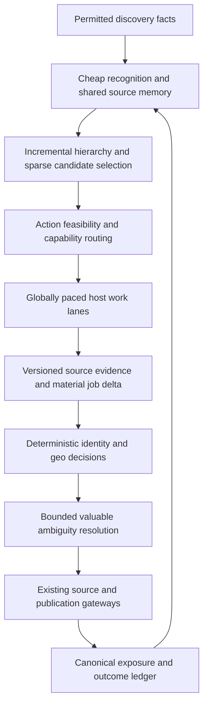

# Sparse Source Attention Strategy

**Date:** 2026-10-03. **Status:** PROPOSED application architecture.
**Program:** SSAE-CED, Sparse Source Attention Engine / Causal Enrichment-Decision.
**Work cards:** [SSAE-00 through SSAE-15](../plans/SPARSE_SOURCE_ATTENTION_IMPLEMENTATION_PLAN.md).

## Purpose and authority

Spend expensive source and job processing on the smallest useful working set,
share evidence across stages, and revisit dormant candidates without repeatedly
reconstructing known facts. Success means better economics for the canonical
fresh, qualified, authorized first-publication flow, with the accepted quality,
freshness, coverage, recovery and source controls preserved.

This strategy supports the [master operating prompt](../bootloaders/MASTER_OPERATING_PROMPT.md)
and [Global Miner overlay](../SOURCE_UNIVERSE_GLOBAL_MINER_MASTER_PROMPT.md).
The [Source Perpetuity implementation plan](../plans/SOURCE_PERPETUITY_IMPLEMENTATION_PLAN.md)
remains the source-domain execution queue. SSAE cards provide bounded supporting
contracts; their presence does not dispatch work or authorize a probe, source
admission, schema mutation, parameter change, publication, deployment or purchase.
Recover current authority and the active source unit before choosing a card.

Keep the [13 mathematical challenges](../plans/MATHEMATICAL_IMPROVEMENT_PLAN.md).
SSAE is a cross-cutting architecture, not an accepted MATH-14 amendment. Preserve
the full Autonomy Cutover Predicate by reference to the
[source masterplan](../SOURCE_REPLENISHMENT_MASTERPLAN.md), every publication
gateway, accepted parameter and opt-out rule. A faster selector cannot resolve a
known publication-control defect; that defect retains priority over rollout.

The owner's pasted research is input, not acceptance evidence. Its 72-result
Exa audit was not repeated here; its mutable counts and reported production
outcomes require remeasurement. No runtime improvement is claimed by this file.

## PH remote cohort attention allocation — 2026-10-03

The [PH priority strategy](PH_REMOTE_SOURCE_PRIORITY_STRATEGY.md) supplies the
108-label temporary high-value cohort and PH-prior/economics inputs. Preserve
the global universe, FULL/REINDEX/REUSE/BOUNDED_REPLAY, permission feasibility,
shared pacing, independent audit and cold-tail revisits. Cohort priority changes
proposed allocation only; selector and cadence integration remain unverified.
Map inventory/profile, memory, empirical ranking, delta/replay, allocator and
canary evidence onto existing SSAE cards under the parent source unit. Source PH
priors never override job geoGate. Conceptual HOT/WARM/COOL/COLD/DORMANT values
are not accepted schedules. Resolve actual publisher latency before promising
15-minute public freshness. Dynamic cohort evidence and economics belong in Turso.

## Verified research and application translation

The latest architecture release verified for this review is V4.1-Flash,
released on 2026-09-10 in the [official changelog](https://api-docs.deepseek.com/updates/).
Recheck the changelog before a later implementation relies on that designation.

The [V4.1-Flash report](https://arxiv.org/html/2609.19969v1) describes 20 causal
encoder and 20 decoder layers, with decoder global KV derived from the encoder;
its 552B backbone activates 8B parameters at prefill and 16B at decode. CSA2
statically assigns Full (compute KV/index), Reindex (share KV, recompute index)
and Reuse (share both); all still compute local queries and sliding-window state.
Hierarchical candidate pools reduce later indexing. Global memory persists while
sliding-window memory is short-lived; bounded replay is approximate, with stated
robustness limits. Its 890 bytes/token measures global HBM KV, not total memory.
Engram and Single-Pass mHC are integrated. Backbone training omits MTP; separate
DSpark supplies speculative drafting and verification. These are neural mechanisms.

Earlier [V3.2 research](https://arxiv.org/html/2512.02556v1) combines a lightweight
DSA indexer with MLA. The released
[configuration](https://huggingface.co/deepseek-ai/DeepSeek-V3.2/blob/main/config.json)
contains `index_topk=2048`; that is a token-attention setting, not a source count.
[Engram](https://github.com/deepseek-ai/Engram) uses deterministic neural N-gram
memory lookup. [mHC](https://arxiv.org/abs/2512.24880) constrains residual mixing.
Independent [crawl scheduling research](https://www.microsoft.com/en-us/research/wp-content/uploads/2019/05/SIGIR__Optimal_Freshness_Crawl_Under_Politeness_Constraints.pdf)
models importance and change under request and host-politeness constraints.

All mappings below are **engineering inferences for this application**, not
DeepSeek implementation instructions or demonstrated application speedups.

| Research motivation | Proposed application mechanism | Boundary |
| --- | --- | --- |
| Asymmetric processing | Cheap deterministic recognition before expensive fetch, parsing and ambiguity resolution | No neural encoder/decoder, GPU fleet or layer count is required |
| Shared compact memory | Versioned source summaries and evidence references reused by downstream decisions | Preserve authoritative facts and sufficient replay evidence |
| Separate scoring from evidence construction | Explicit FULL, REINDEX and REUSE action modes | No reuse after a relevant dependency expires or changes |
| Hierarchical selection | Incremental cohort summaries and bounded candidate pools | Maintain a measured cold-tail revisit and audit path |
| Memory with different lifetimes | Durable provenance, reusable summaries, short-lived execution state | Retention rights and current policy govern each tier |
| Recover only affected state | Exact evidence-dependent bounded application replay | Neural approximate replay cannot justify approximate policy evidence |
| Lookup before reconstruction | Typed capability, identity and valid-decision lookup | A keyed database lookup is not a guaranteed O(1) system operation |
| Constrained routing | Bounded fan-out, resource reservations, hysteresis and backpressure | Soft scores cannot trade away a hard constraint |
| Proposal followed by verification | Cheap rules propose exclusion or qualification; current gates verify | Speculation never produces public exposure |

Do not import model byte footprints, compression ratios, parameter counts or
Top-K constants into application budgets. No provider switch, new model API,
neural training job or new service is selected by this strategy. The attachment's
separate Thompson-crawler percentage claim remains unverified and is not an
acceptance benchmark.

## Code baseline and integration boundaries

These are **VERIFIED_CODE** observations at the documentation review baseline
`a176bb5d881eb7314222f534a7d1f63f02691987`, not current runtime measurements.
Fetch and restate the complete start SHA before implementation; automation may
advance `origin/main` while a unit is open.

| Anchor | Observed behavior | Proposed investigation |
| --- | --- | --- |
| `scripts/lake/import-source-registry.ts:105` | `stratifySample()` selects deterministic evenly spaced entries per family | Preserve reproducible control; build a separately specified random audit |
| `scripts/lake/reconcile-discovered-corpus.ts:64` and `:119` | Discovered rows ordered by id feed that sampler | Evaluate an additive read-only ranker before changing actual selection |
| `scripts/lake/ingest-to-lake.ts:51` | Fingerprint OR source URL match records a sighting and returns before `geoGate` | Establish material-field and dependency validity before reusing classification |
| `scripts/lake/lake-shared.ts:32` | Fingerprint uses normalized company/title/application hostname | Keep identity matching distinct from evidence-content equivalence |
| `packages/scraper/conditional.ts` | Validator headers and body hashes support unchanged-fetch results | Trace caller persistence, policy checks, TTL and replay completeness |
| `packages/scraper/capability-registry.ts` | Typed capability routing already exists | Reuse permitted dispatch and measure unknown-source fan-out |

Likely surrounding integration points include `run-lake-miner.ts`, discovery,
replay, lake run/sighting ledgers and existing GCP runners. Their adequacy for
this design is **PROPOSED**, not verified by the anchors above. Check schema,
caller paths, credentials, schedules, deployment and execution separately.
Turso is an evidence plane where the current architecture permits; D1 remains
the governed serving plane. Define fact ownership and replication direction.
No lake state, score or cache mode confers D1 publication authority.

## Processing path



Feasibility is checked while assembling candidates and again immediately before
the consequential action. A source may permit discovery lookup or a bounded
probe while disallowing publication. A source rejected for collection is never
fetched merely to compute a score. Reuse the result of one permitted fetch and
normalization across consumers rather than fetching or asking an LLM repeatedly.

## Compact source memory

Map logical fields to existing schema before proposing additions. Prefer a
read-only derivation or view, then additive fields/table only when measured
query cost and recovery requirements justify it. Avoid a second source registry.

| State group | Minimum useful contents |
| --- | --- |
| Identity/routing | Exact source/tenant identity, canonical employer, host and shared provider rate domain, capability and discovery provenance |
| Feasibility | Evidence references, permitted action and fields, policy/lease/opt-out versions, operational state and next eligible action |
| Observations | Original source/observation clocks, validators, content/material-field digests, completeness and raw-evidence references |
| Outcomes | Compatible exposure horizon, marginal canonical fresh publication outcomes, qualification intermediates, censoring and attribution |
| Costs/health | Actual requests, bytes, CPU, waits, DB reads/writes, AI work, failures, cooldown and queue residence |
| Derived state | Feature/index/decision versions, uncertainty, counts, next cold revisit and dependency set |

Unknown is a first-class value. Missing job dates, missing raw fields, unobserved
outcomes, unsupported capabilities and expired source evidence cannot be filled
with a favorable default. Counts must name their unit: canonical sources,
tenants, jobs, attempts, sightings and publication events are different objects.
Material digest normalization must be versioned; a body hash alone does not
identify a canonical job or prove its freshness.

Retain cheap identity/provenance and lawful evidence references durably; keep
reusable summaries under their policy TTL; keep transient parsing/index buffers
and leases short-lived. These are logical tiers until mapped to accepted
retention. Deletion, opt-out, expiry and backup erasure propagate to every tier.
Do not promise replay coverage beyond the fields actually retained.

## Exclusive action modes and invalidation

For each `(entity, action, epoch)`, assign exactly one processing mode and an
independent feasibility/disposition. A skipped or forbidden action can be
recorded without executing any mode. The labels are proposed application
vocabulary, separate from source governance/readiness/health database enums.
Do not write these values to an existing enum column without a supported contract.

| Mode | Preconditions and work | Invalidating cases |
| --- | --- | --- |
| FULL | Required evidence is absent, expired or materially changed; perform only the permitted bounded evidence construction and qualification | Missing authority prevents fetch; missing required evidence prevents favorable reuse |
| REINDEX | Evidence remains sufficient and valid; only ranking, budget, portfolio or derived features changed; rescore cached state | A policy or qualification dependency change needs replay or fresh evidence |
| REUSE | Evidence, relevant versions, lease, opt-out and due status remain valid; perform the minimum required ledger/heartbeat work | TTL, withdrawal, schema, parser, identity, geo, policy or model invalidation overrides reuse |
| BOUNDED_REPLAY | A known changed dependency affects specified retained records; reconstruct the exact required decision evidence in a capped batch | Missing fields, unknown dependencies, expired retention or unverifiable reconstruction force conservative hold or permitted FULL work |

Dispatch order is conservative: enforce authority/withdrawal and due limits;
test evidence completeness and invalidations; choose bounded replay when exact
retained evidence suffices, otherwise permitted FULL; choose REINDEX for ranking
changes alone; choose REUSE only after the previous checks. Do not continue a
mode after a concurrent authority/version change; revalidate its reservation.

An actual TypeScript checkpoint can map the following conceptual contract to
existing tables after schema review:

```typescript
type ProcessingMode = "FULL" | "REINDEX" | "REUSE" | "BOUNDED_REPLAY";
type Dependency = "GEO" | "REMOTE" | "IDENTITY" | "URL" | "SOURCE_AUTHORITY"
  | "POLICY" | "PARSER" | "SCHEMA" | "MODEL" | "TAXONOMY";
type AttentionCheckpoint = {
  entityId: string; action: string; epoch: string; mode: ProcessingMode;
  evidenceRefs: string[]; evidenceComplete: boolean;
  versions: Record<string, string>; dependencies: Dependency[] | null;
  reason: string; feasibilityReceipt: string; observedAt: string;
};
```

The snippet is a proposed type, not a deployed schema. Unknown dependency sets
invalidate conservatively rather than escaping a replay filter. The application
must recover exact evidence required by its gates; approximate reconstruction
is insufficient. Batch bounds limit work, not correctness. Restrictive invalidation
includes affected qualified, synced and publicly visible records; replay must not
inspect only previously rejected or ambiguous jobs.

A conditional 304 still costs a request and latency. It says the validator
matched; it cannot certify current source permission, policy evidence, opt-out
status, a complete job census or a fresh source-quality observation. An unchanged
200 also pays network/body-hash cost. Distinguish reuse without a network action
from unchanged responses following a real FULL evidence check. Record network work
as performed rather than relabeling it REUSE to improve reported mode fractions.

## Job material changes and safe differential work

Keep identity resolution and content equivalence separate. A same URL or
fingerprint may refer to a job whose PH geography, remote restriction,
description, role, safety, application destination or dates changed. A different
URL may be the same canonical opportunity. Preserve sightings and original
clocks without inventing another first publication.

Version a digest over the fields each decision actually uses. Reevaluate only
affected rules when exact inputs exist; do not skip geo because the source URL
matched. Changes in source authority, opt-out, lease or withdrawal must propagate
even if no job field changed. Unknown/raw-incomplete evidence is held or fetched
through a permitted path, never marked equivalent by an identity-only hash.

Job-ID deltas help discover additions, but unchanged IDs do not prove unchanged
material fields. A partial, failed, paginated or capped snapshot cannot establish
deletions and must not mass-archive jobs. Record complete-snapshot proof and
source-specific withdrawal semantics before deriving absence. Replays append
versioned supersession and remain idempotent across retries and concurrent workers.

## Hierarchical indexing, routing and queue control

Use established facts for cohorts: capability/family, shared host/provider,
discovery origin, evidence maturity and observed yield class. Maintain summaries
incrementally from observation and invalidation events. Version a bounded
candidate pool; score changed/due candidates and affected summaries. A budget
change may reorder the existing pool without refetching its evidence.

An initial full enumeration, scheduled rebuild or bounded integrity audit may
be necessary. Account for it; do not replace deep O(N) work with an O(N) DB scan
and O(N) heartbeat every epoch. Measure rows read, index updates, memory and stale
summary rates. Hysteresis, bounded weights and versioned pool refresh prevent
oscillation. Cold candidates remain recoverable, with explicit due dates and a
coverage/audit trigger; dormancy is neither deletion nor permanent starvation.

Route to one supported capability when reliable evidence identifies it. Unknown
sources receive only permitted, bounded discriminating work. Never test every
ATS template by default. Capability support and authority are independent.

Bound work queues by items, bytes, residence and outstanding reservations. Track
arrivals, completions, retries, losses and in-flight work at matching boundaries.
Backpressure selection when the slowest stage saturates. Queue equations and
Little's law are diagnostics under their assumptions, not proof that an unstable
run is safe. Do not infer capacity from observed completions alone.

Enforce pacing for the actual provider rate domain across GCP shards, Actions,
Worker clocks, retries and ATS tenants. Separate tenant names do not establish
independent hosts. Use an existing shared lease/budget mechanism where suitable;
otherwise contract it before adding concurrency. Local per-shard delays cannot
enforce a global limit. Cluster recovery, clock failover and late retries must
respect the same global reservations and Retry-After across the shared rate domain.
Parallelize independent domains only
after profiling, with bounded retries and downstream capacity.

## Allocation objective and simplest baselines

Let `g(i,a,t)` be hard feasibility for exact source `i`, action `a`, epoch `t`.
Probe, replay, refresh and publish have distinct feasibility. For a fixed
observable horizon H, define reward as marginal canonical opportunities whose
authorized first exposure is actually observed in the accepted fresh-discovery
cohort during H. Record discovery candidates, qualified-ready backlog, delayed,
blocked and censored publication separately. A source lead is not this reward.

Estimate `mu(i,a,t)` from comparable mature evidence available before selection.
Deduplicate cross-source opportunities and separate source attribution from
credit assignment. Reward is portfolio-dependent: two selected sources can
produce the same job. Do not sum independent per-source counts and call the sum
marginal unique supply. Shared host budgets also create interference.

For selection variables `x(i,a)` in `{0,1}`, a proposed allocator maximizes
estimated useful marginal reward within the accepted lexicographic priorities,
subject to:

```text
x(i,a) <= g(i,a,t)
sum_a x(i,a) <= 1 for incompatible actions on an entity in an epoch
sum_i,a x(i,a) * cost(i,a,r) <= budget(r) for each scarce resource r
shared-host/provider pacing, downstream capacity, and accepted portfolio limits
```

Start with reproducible deterministic family control, recent compatible yield
with uncertainty/age, and simple cohort shrinkage. Evaluate cold-start behavior
and cost estimation before fitting a ranker. Count models such as Poisson-Gamma
or negative binomial are optional if dispersion and temporal holdout evidence
justify them; binary eligibility models need genuinely binary observation units.

Thompson sampling, uncertainty bonuses, learned rankers and shadow prices are
later experiments, not prerequisites. A soft index may combine expected reward,
bounded exploration and resource costs; hard constraints still apply afterward.
An approximate greedy allocator is a heuristic, not a proven global optimum.
If adaptive prices are tested, cap step sizes and coefficients, use hysteresis,
and verify saturation/oscillation under missing telemetry and load shocks.

Polling allocation uses measured meaningful change and freshness benefit within
source minimum/maximum cadence, cache TTL, backoff and global budgets. Test simple
cadence classes first. Memoryless Poisson/freshness formulas require validated
arrival assumptions; more complex optimization must beat the empirical baseline.
Never increase polling to drain a source-policy hold or treat a 304 as new yield.

## AI value and speculation

Known capability, identity, digest and valid decision resolve through lookup.
Use existing deterministic geo and safety rules before optional AI. Consequential
ambiguity can enter the existing authorized AI/Jev decision class when expected
decision benefit exceeds inference, latency, error, retry and review cost.
Missing policy facts remain missing; a model opinion cannot supply authority.

Compare an AI route with the deterministic/fallback route on independently
adjudicated cases, including abstentions and harm. Cache outputs with evidence,
model/prompt/rule versions and dependency invalidations. Do not repeatedly ask
models for known facts or treat model agreement as employer evidence. Cheap
speculative decisions remain proposals until the existing gates verify them.

## End-to-end cost and efficiency

For an initial pass, `N*C_light + K*C_deep` is a planning model only. It excludes
important costs unless explicitly included. There is no universal 100x target
or measured speedup in this proposal. Baseline and treatment need matched work,
windows, budgets and quality; a smaller processed population is not equivalent
to completing the original workload faster.

Track total incremental cost as FULL + REINDEX + REUSE + BOUNDED_REPLAY work,
plus hierarchy updates, DB reads/writes, memory/storage, audit, heartbeat,
rebuilds, retries, network requests and orchestration. Charge conditional fetches
to network cost; charge reuse receipts to ledger cost. Report absolute avoided
work and costs, not just favorable fractions with shifting denominators.

Apply Amdahl's law using measured bottleneck share `P` and component gain `s`:
`S = 1 / ((1-P) + P/s)`. Include the costs introduced by this controller and
report actual end-to-end throughput, wall time and latency. A cache hit, lower
AI call count or faster index does not establish improved publication flow.

## Evaluation and inference contract

Historical replay uses immutable features as of selection, mature outcomes and
temporal holdouts. Freeze feature/label versions and avoid future source status,
posting evidence, publication receipts or company knowledge leaking backward.
Historical unselected sources usually lack outcomes; an offline ranking score
on observed candidates cannot prove counterfactual yield for unseen sources.

Shadow mode independently emits hypothetical work from the same frozen input;
the current selector alone controls real work. Never probe extra candidates to
evaluate a shadow without a separately contracted permitted audit. Selection
agreement and overlap can be measured read-only; unseen candidate yield remains
unknown. Historical deterministic stride sampling is reproducible, not an
unbiased random sample or randomized causal control.

Random audits need a defined eligible population, sample unit, strata, draw/seed,
nonzero recorded inclusion probabilities, budget, missingness and observation
horizon. Keep discovery-probe audits separate from already-admitted publication
experiments. Shared hosts, duplicate jobs, repeated epochs and competition for
publication capacity complicate inference; design randomization and analysis
for those clusters and interference rather than assuming independent rows.

Horvitz-Thompson or inverse-propensity estimates require valid sampling support,
known propensities, appropriate inclusion/joint probabilities and compatible
outcomes. Adaptive selection propensities are not available merely because the
controller uses randomness. No global Recall@K, missed-universe yield, regret or
causal improvement is certified without a defensible population/comparator and
design. Sample-specific yield capture can be reported with its denominator and
limits. A zero or unobserved denominator is undefined, not perfect recall.

Before a live experiment, predeclare primary benefit, minimum meaningful effect,
quality/freshness/coverage noninferiority margins, allocation, power/sample
requirements, window, reward maturity lag, missingness treatment, stopping and
rollback rules. Use accepted parameters where present; proposed unset margins
are not runtime defaults. Fixed-alpha analyses must not repeatedly peek and stop
on significance; use a declared sequential procedure or fixed decision horizon,
with multiplicity handled across endpoints and iterations.

Report counts and uncertainty on mature comparable horizons. Unobserved,
pending, held, failed and censored outcomes are not zeros. Independent labels
are needed for PH/remote correctness, false negatives and duplicate integrity.
Separate publication delay from retrieval delay and blocked authority from
selector failure. Maintain original receipts plus corrected labels with lineage.

## Gates, failure recovery and acceptance

Code, deployment, representative operation and acceptance are separate states.
An exact-SHA green build proves none of the other three. Mature canary evidence
must include actual qualifying observations; elapsed time and cache heartbeats
cannot manufacture them. Read-only/historical cards can finish with an explicitly
limited result; rollout cards need the declared operational window and evidence.

| Failure | Required response |
| --- | --- |
| Unauthorized collection/publication or opt-out leak | Stop the affected path, propagate withdrawal through the existing controls, preserve incident receipts |
| Same URL reused after material or rule change | Hold/replay affected decisions, repair dependency coverage and evaluate independent fixtures |
| Partial snapshot creates deletions | Stop absence-derived writes; restore through existing source-scoped recovery with provenance |
| Missing raw replay fields or unknown dependencies | Fail conservatively, surface coverage debt; no favorable reconstructed evidence |
| Host overload, duplicate clock execution or retry storm | Fence conflicting workers, restore accepted pacing and global budget enforcement |
| Cold-tail starvation or unsupported inference | Restore control allocation/audit coverage, retract invalid recall or causal claims |
| Queue growth, cache/index oscillation or cost regression | Reduce admission pressure; restore the last accepted selector/cache version |
| Missing exposure receipts or delayed outcomes | Suspend reward updates and acceptance; report unknown/censored coverage |

Rollback restores a known selector/cache version and drains/fences outstanding
work safely; it must not restore expired permission, recreate withdrawn data or
reset freshness. Run a source-scoped rollback and independent resume drill
before graduation. Preserve lawful evidence of negative outcomes and rejected
models. A lower-cost baseline retained after evaluation is a valid result.

## Connection to all 13 mathematical challenges

| Challenge | SSAE contribution and evidence required |
| --- | --- |
| MATH-01 allocation | Mature marginal rewards, hard feasibility, simplest allocator and separately evaluated exploration |
| MATH-02 queues | Matching stage telemetry, bounded admission and backpressure under retries and failures |
| MATH-03 coverage | Candidate-pool/audit coverage and marginal distinct opportunities across cohorts |
| MATH-04 polling | Observed material-change benefit, accepted cadence and shared-host cooldown |
| MATH-05 quality | Independent class-specific labels and risk/coverage evidence through unchanged gates |
| MATH-06 publication | Every reuse/replay/sync still passes current authority, opt-out and exposure controls |
| MATH-07 inventory | Lawful retention, freshness decay and explicit backlog/replay cohorts |
| MATH-08 concentration | Provider/host/employer/clock failure domains, overlap and source-loss drills |
| MATH-09 identity | Identity/content separation, canonical credit, reversible linkage and sightings |
| MATH-10 changes | Material digests, version dependencies, conservative invalidation and exact bounded replay |
| MATH-11 AI value | Measured ambiguity benefit against total cost, abstention and deterministic fallback |
| MATH-12 health | Complete source-level attempts, failures, cooldown, stale summaries and anomaly evidence |
| MATH-13 compute | Comparable stage profile, full overhead, Amdahl bound and observed end-to-end effect |

SSAE graduation does not accept all 13 challenges, certify autonomous cutover,
or prove the daily supply floor. The canonical metric remains `FreshFlow(D)`
over complete Asia/Manila days; the 100/day floor and 150/day stretch retain
their own accepted maturity and publication evidence requirements.

## Checkpoint contract

For each supporting card, record its parent source unit, status and owner,
start/behavior/docs SHAs, deployed version and run evidence where applicable,
frozen input/feature/cache/selector versions, exact mutations or read-only scope,
mode distribution and denominators, cost, host/queue health, mature reward and
unknown coverage, audit design/results, negative findings, acceptance disposition,
rollback and one dependency-ready next action. Keep recovery pointers concise;
link evidence rather than duplicating mutable counts across documents.
